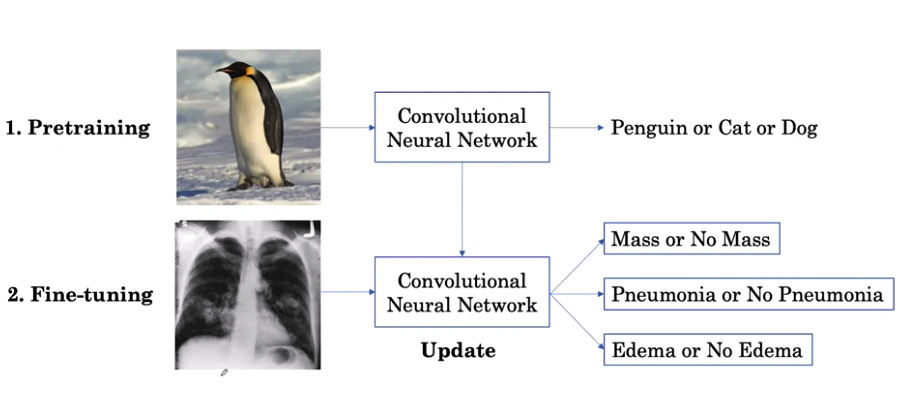
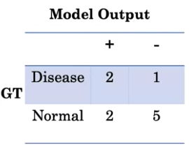
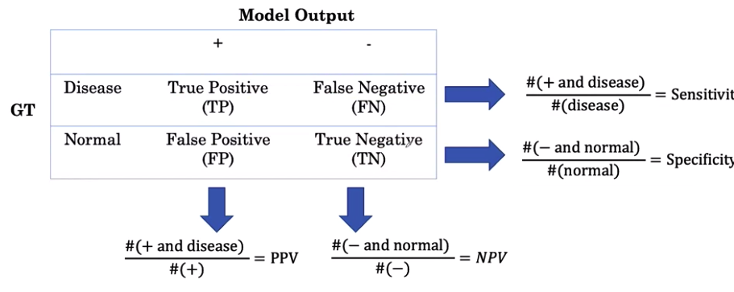
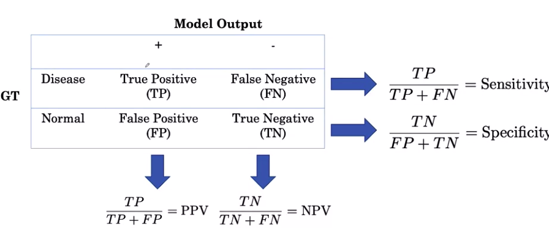
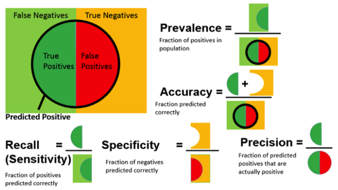
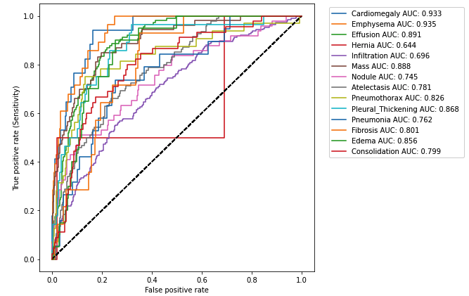

---
jupytext:
  text_representation:
    extension: .md
    format_name: myst
kernelspec:
  display_name: Python 3
  language: python
  name: python3
---
(ai_in_medicine)=

# AI for Medical Diagnosis #

## Week 1 - Medical Image Classification

### Resources
- Public Chest Xray 
    - dataset - https://nihcc.app.box.com/v/ChestXray-NIHCC
    - article - https://www.nih.gov/news-events/news-releases/nih-clinical-center-provides-one-largest-publicly-available-chest-x-ray-datasets-scientific-community
- Public CT Scans 
    - dataset - https://nihcc.app.box.com/v/DeepLesion
    - article - https://www.nih.gov/news-events/news-releases/nih-clinical-center-releases-dataset-32000-ct-images
- Image Preprocessor - https://keras.io/api/preprocessing/image/
- Journal Articles
    - Computer vision for Histopathology - https://www.ncbi.nlm.nih.gov/pmc/articles/PMC6257102/
    - Computer vision for Dermatology - https://www.nature.com/articles/nature21056
    - Computer vision for Endocrinology - https://www.nature.com/articles/s41433-018-0269-y

#### 3 Key Challenges for Medical Images

#### `1. Class Imbalance Challenge`

- `definition`: not equal number of positive (e.g. abnormal) and negative (e.g. normal) examples
- creates a problem for learning algorithm who see's many normal examples
- optimizing its updates to get normal examples to be right and not giving much relative weight not normal examples
    
##### Different types of Loss
1. Categorical Cross-Entropy Loss
1. Binary Cross-Entropy Loss
1. Cross-Entropy Loss
1. Softmax Loss
1. Logistic Loss

##### Problem: Binary Cross Entropy Loss
- `measures the performance of a classification model whose output is between 0 and 1`
- Regular Loss Function 

\begin{align}
    L(X,y) = \left\{ 
        \begin{matrix}
            -log P (Y=1|X) & if & y = 1 \\
            -log P (Y=0|X) & if & y = 0 \\
        \end{matrix} 
    \right\}
\end{align}

- `computational note` 
    - compute for probability equal to 1, given X: `P(Y=1|X)` 
        - formula
        \begin{align}
            L & = -logX 
        \end{align}
        - e.g. Malignant Sample (Y=1), Probability = 20% 
        \begin{align}
            L & = -log(0.20)  \\
            L & = 0.70 
        \end{align}

    - compute for probability equal to 0, given X: `P(Y=0|X)`
        - formula
        \begin{align}
            P(Y=0|X) & = 1 - P(Y=1|X) \\
            L & = -log(1 - X)  \\
        \end{align}
        - e.g. Benign Sample (Y=0), Probability = 70% 
        \begin{align}
            L & = -log(1 - 0.70)  \\
            L & = 0.52
        \end{align}
            
##### Solution 1: Weighted Loss 

- add weight relative to sample label or class
- Formula: Weighted Loss Function 
\begin{align}
    L(X,y) &= \left\{ 
        \begin{matrix}
            w_{p} &x& -log P (Y=1|X) & if & y = 1 \\
            w_{n} &x& -log P (Y=0|X) & if & y = 0 \\ \\
        \end{matrix} 
    \right\} 
\end{align}

\begin{align}
    L_{pos} &= w_{p} \times -log P (Y=1|X) \\ 
    L_{neg} &= w_{n} \times -log P (Y=0|X) \\ \\
    L^{(i)} &= loss_{pos}^{(i)} + los_{neg}^{(i)} \\
    L_{pos}^{(i)} &= -1 \times weight_{pos}^{(i)} \times y^{(i)} \times log(\hat{y}^{(i)}) \\
    L_{neg}^{(i)} &= -1 \times weight_{neg}^{(i)} \times (1- y^{(i)}) \times log(1 - \hat{y}^{(i)})
\end{align}

    where
\begin{align}
w_p = \frac{num ​​ negative}{num ​​ total}
\end{align}

\begin{align}
w_n = \frac{num ​​ positive}{num ​​ total}
\end{align}

##### Solution 2: Resampling
- to achieve equal number of normal and non-normal examples
- Formula: Regular Loss Function
\begin{align}
    L(X,y) = \left\{ 
        \begin{matrix}
             -log P (Y=1|X) & if & y = 1 \\
             -log P (Y=0|X) & if & y = 0 \\
        \end{matrix} 
    \right\}
\end{align}
    - `note`: no need to add weights but will yeild equal contribution 
- approaches
    - under sampling normal class 
    - over sampling non-normal class
        - replicating non-normal samples to reach quota

#### `2. Multi-Task Challenge`
- Binary Classification/Task
    - only 2 classes  in one model
        - e.g. benign vs malignant
- Multi-task
    - multiple classes in one model
        - e.g. mass or no mass, pneumonia or no pneumonia, edema or no edema
    
- Formula: Multi-Label/ Multi-Task Loss
\begin{align}
            L(X, y) & = L(X, y_{mass}) + L(X, y_{pneumonia}) + L(X, p=y_{edema})
\end{align}

- Sample Data

| Examples   (mass, pneumonia, edema) | Predicted Probabilities | Loss |
| --- | --- | --- |
| P1 0, 1, 0 | 0.3, 0.1, 0.8 | 0.52 + 1.00 + 0.70 |
| P2 0, 0, 1 | 0.1, 0.1, 0.8 | 0.05 + 0.05 + 0.10 |
| P3 0, 1, 1 | 0.2, 0.2, 0.7 | 0.10 + 0.70 + 0.15 |

- Formula: Binary Cross-Entropy Loss for Multi-Task Setting
\begin{align}
    L(X, y_{mass}) & = 
    \left\{ 
        \begin{matrix}
            w_{p, mass} &x& -log P (Y=1|X) & if & y = 1 \\
            w_{n, mass} &x& -log P (Y=0|X) & if & y = 0 \\
        \end{matrix} 
    \right\} \\
    L(X, y_{pneumonia}) & = 
    \left\{ 
        \begin{matrix}
            w_{p, pneumonia} &x& -log P (Y=1|X) & if & y = 1 \\
            w_{n, pneumonia} &x& -log P (Y=0|X) & if & y = 0 \\
        \end{matrix} 
    \right\} \\
    L(X, y_{edema}) & = 
    \left\{ 
        \begin{matrix}
            w_{p, edema} &x& -log P (Y=1|X) & if & y = 1 \\
            w_{n, edema} &x& -log P (Y=0|X) & if & y = 0 \\
        \end{matrix} 
    \right\} \\
    L(X, y) & = L(X, y_{mass}) + L(X, y_{pneumonia}) + L(X, p=y_{edema})
\end{align}

#### `3. Small Dataset Size Challenge`

- medical image datasets typically have `10 - 100 thousand` examples compared to millions on natural objects

- medical imaging challenges
    - model of choice is Convolutional Neural Networks
    
- different architectures of Convolutional Neural Networks
    1. Inception-v3
    1. ResNet-34
    1. DenseNet - https://arxiv.org/pdf/1608.06993.pdf
    1. ResNeXt 
    1. EfficientNet 
    
    
#### Solution 1: `Feature Learning` 
- Pretraining + Fine Tuning

 
 
- Steps
    1. Pretraining
        1. train the network to look at natural images and learn to identify natural objects to learn `general features` (e.g. edge detection feature) - using `Early Layers`
        1. copy and transfer learned features to next network layer
    1. Fine-Tuning
        1. further be trained to look at chest X-rays and identify the presence and absence of disease
        1. general features learned in pretraining can be then applied in the new task for `high-level features` - more specific to a task (e.g. Chest Xray) - using `Late Layers`
        1. only fine-tune Late Layers

- Solution:  `Feature Learning`

#### Solution 2: `Sample Generation` 
- Options
    1. Data Augmentation
        - Types of Transformation
            - Rotate + Flip
            - Rotate + Crop + Color Noise 
            - Reverse image orientation (Lateral inversion)
                - tricky in medicine due to medical conditions (e.g. dextrocardia)
            - Zooming in and out
            - Brightness and Contrast
            
            
### II. How well your model performs 
#### Model Testing
- Dataset Distribution
    - Training Set/Development Set
        - development and selection of models
        - use to learn a model
    - Validation Set/Tuning Set/Dev Set
        - use for hyperparameter tuning
        - estimate of model performance on test set
    - Test Set/Holdout Set
        - reporting of final results
 - `Cross Validation`: split between training and validation set
 
#### 3 Key Challenges in Building Sets

#### `1. Patient Overlap`
 - `Problem`: a single patient's multiple x-ray should only occur in 1 set (i.e. Training set)
     - the model may `memorize` a patient x-ray in training set and help get the right answer in test set (overly optimistic test performance)
 - `Solution`: a single patient with multiple x-ray should only have all x-ray data in 1 data set (e.g training set)
     
#### `2. Set Sampling`
##### Steps
1. Sample Test Sets 
    - sample first before validation and training
    - usually `10 %` of the whole dataset
    - test set needs to be annotated by human readers
        - bottleneck is the readers capacity to label
        - at least 100 of examples in medical AI studies
    - `Problem`:  might not be able to sample any patient with a particular disease that wasn't labeled, thus no way of testing the model for that particular disease
    - `Solution`: test set with at least `X%` of examples of minority class (i.e. positive class, malignant class)
        - if possible set to 50% (e.g. 50% with mass, 50% no mass) of total test sets
1. Sample Validation Set
    - use same sampling strategy and numbers of examples for Test Sets to reflect the Test set's distribution 
1. Sample Training Set
    - the remaining patients or datasets

#### `3. Ground Truth (Machine Learning)` or Reference Standard (Medicine)
- `Problem`: inter-observer disagreement
    - common in medicine
- `Solution 1`: consensus voting method
    - single decision or majority vote of group of human expert
    - e.g. Chest X-ray with radiologist experts
- `Solution 2`: definitive test 
    - confirmatory method relative to disease type
    - e.g. CT-Scan
    
## Week 2 - Key Evaluation Metrics 

### Resources
- ROC visualizer 
    - link -  http://www.navan.name/roc/
    - paper - https://people.inf.elte.hu/kiss/13dwhdm/roc.pdf
    
### I. Accuracy, Sensitivity, Specificity

#### Accuracy and Probability
- proportion of the total examples that the model correctly classified
    
    \begin{align}
    Accuracy & = \frac{examples ​​ correctly ​​ classified}{total ​​ numbers ​​ of ​​ examples} \\
    & = P(correct) \\
    & = P(correct \cap disease) + P(correct \cap normal)
    \end{align}

- The `Law of Conditional Probability` expands the definition of Accuracy
    
    \begin{align}
    Using P(A \cap B) & = P(A|B)P(B)
    \end{align}
    
    `note`: the probability of A and B is equal to Probability of A given B times the probability of B
    
- adapted formula
    
    \begin{align}
   Accuracy & = P(correct|disease)P(disease) + P(correct|normal)P(normal) \\
   & = P(+|disease)P(disease) + P(-|normal)P(normal)
    \end{align}
    
#### Sensitivity or `True Positive Rate` or `Recall` 

- Formula
    \begin{align*}
    P(+|disease) & = \frac{ \# (+ ​​ and ​​ disease) }{\#(disease)} \\
    & = \frac{TP}{TP + FN}
    \end{align*}
    
    - `interpretation`: the probability of being `correct` given the patient has `disease` means 'positive'
    
#### Specificity or `True Negative Rate`  

- Formula
    \begin{align}
    P(-|normal) & = \frac{ \# (- ​​ and ​​ normal) }{\#(normal)} \\
    & = \frac{TN}{FP + TN}
    \end{align}
    
    - `interpretation`: the probability of being `correct` given the patient is `normal` means 'negative'

    
#### Prevalance 
- Prevelance
    - the number of disease or actual positive cases over total popluation
    
    \begin{align}
        Prevelance & = \frac{\#(disease)}{\#(total)} \\
        & = \frac{1}{N} \sum_i y_i \\
        & = np.mean(y)
    \end{align}
    
#### Accuracy in terms of Conditional Probability
- accuracy is the weighted average of sensitivity and specificity
    \begin{align}
       Accuracy & = P(+|disease)P(disease) + P(-|normal)P(normal) \\
       & = Sensitivity + Specificity \\
       & = Sensitivity \times P(disease) + Specificity \times P(normal) \\
       & = Sensitivity \times P(disease) + Specificity \times 1-P(disease) \\
       & = Sensitivity \times prevalence + Specificity \times 1-prevalence \\
    \end{align}
    
### II. Predictive Values
#### Positive Predictive Value (PPV) or `Precision`
- Sensitivty Notation 
    
    \begin{align*}
    P(+|disease) 
    \end{align*}
    
    `interpretation`: given we know that the patient has disease, what is the probability that the model predicts positive
    
- Positive Predictive Value 
    - Formula

    \begin{align*}
    P(disease|+)  & = \frac{\#(+​​ and ​​ disease)}{\#(+)} \\
    & = \frac{TP}{TP + FP}
    \end{align*}
    
    `interpretation`: given that the model predicts postive on a patient, what is the probability that the patient actually have the disease
    
#### *Positive Predictive Value in terms of Sensitivity, Specificity, and Prevalence 

- Rewriting `PPV`
    \begin{align*}
    PPV = P(pos|\hat{pos})
    \end{align*}
    - `pos` is the "actual positive"
    - `𝑝𝑜𝑠^` is the "predicted positive"
    
- by Bayes Rule,
    \begin{align*}
    PPV = \frac{P(pos|\hat{pos}) x P(pos)}{P(\hat{pos})}
    \end{align*}
    
##### For Numerator
- Formula
    \begin{align*}
        Sensitivity & = P(pos|\hat{pos}) \\
        Prevalence & = P(pos)
    \end{align*}

    - `sensitivity`: how well the model predicts actual positive cases as positive
    - `prevalence`: how many actual positives there are in the population
    
        
##### For Denominator 
- Formula
    \begin{align*}
        P(\hat{pos}) = TruePositive  + FalsePositive 
    \end{align*}
    - `predicted positives`: positive predictions are the sum of when it correctly predicts positive and incorrectly predicts positive.

    - `TruePositives` 
        - Formula
            \begin{align*}
            TruePositives & = P(\hat{pos}|pos) \times P(pos) \\
                          & = Sensitivity \times Prevalence 
            \end{align*}
    - `FalsePositives` 
        - Formula
            \begin{align*}
            FalsePostives & = P(\hat{pos}|neg) \times P(neg) \\
                          & = (1-Specificity) \times (1-Prevalence)
            \end{align*}

##### Final Derivation (PPV)

- Formula
    \begin{align*}
        PPV & = \frac{P(pos|\hat{pos}) x P(pos)}{P(\hat{pos})} \\
            & = \frac{Sensitivity \times Prevelance}{TruePositve + FalsePositive} \\
            & = \frac{Sensitivity \times Prevelance}{
            Sensitivity \times Prevalence 
            + 
            (1-Sensitivity) \times (1-Prevalence)
            } \\
    \end{align*}
    
#### Negative Predictive Value (NPV)
- Specificity  Notation
    
    \begin{align*}
    P(-|normal) 
    \end{align*}
    
    `interpretation`: given we know that the patient is normal, what is the probability that the model predicts negative 
    
- Negative Predictive Value 
    - Formula

    \begin{align*}
    P(normal|-) & = \frac{\#(- ​​ and ​​ normal)}{\#(-)} \\
    & = \frac{TP}{TP + FP}
    \end{align*}
    
    `interpretation`: given that the model predicts negative on a patient, what is the probability that the patient actually is normal 
    
    
#### F1 Score or `F-score` or `F-measure` 
- harmonic mean of precision and recall
    \begin{align*}
    F_1 score = 2 \times \frac{Precision \times Recall}{Precision + Recall}
    \end{align*}

#### Confusion Matrix
- use to look the performance of classifier in tabular presentation
    - can be used to compare the results of each classifier models
        - e.g. k-nearest vs logistic regression vs decision tree
- use to visualize the performane of binary classifier
    - but can be extended up to `3 classes` using `one vs all approach`
- tells what the machine learning algorithm did right and did wrong
- can be used to 3 or more classes

    - Ground Truth vs Model Output
    
    

    - Formula Summary 
    
    
    
    - Formula Transformation 
    
    
    
    - Visual Representation 
    
    
    

### III. ROC (Receiver Operator Characteristics) / AUC (Area Under the Curve)

- visual plot the sensitivty against the specificty at different decision thresholds 
- `threshold` or `operating point` or decision boundary
    - choosing the threshold is a business  or use case decision
- the choice of threshold affects the evaluation metrics being used
- is similiar to statistical boostraping, but instead of resampling to get the mean and draw a histogram out of the means, ROC is drawn out by adjusting the thresholds of the choosen algorithm (e.g. Logistic Regression). As thresholds are adjusted, corresponding confusion matrix also changes. When plotting all the confusion matrix in a X-axis (True Positive Rate) vs Y-axis (False Positive Rate), the final result will yeild a ROC graph

- `diagonal line` shows where the `True Positive Rate == False Positive Rate`
    - any point in the line means that the proportion of correclty (i.e. true positve) classified samples is the same as the proportion of the incorreclty (i.e. false positive) classified samples.
    - any point in the left part of the line means the porportion of correctly classified samples is greater than the incorreclty classified samples

#### `ROC Graph`
- summarizes all confusion matrices that each threshold produced

- ROC Sample
    
    
    
### IV. Confidence Interval 
- shows the variability of the estimates
- use to infer the sample size in comparison to population size
- `95% confidence`
    - `interpretation`: in repeated sampling, this model or method produces intervals (minimum and maximum interval) that include or will contain the population `accuracy` or `true` accuracy or `true` parameter/metric in about 95% of the samples
         - `accuracy` is arbitrary, any evaluation metrics may be used
         
## Week 3 - Image Segmentation on MRI

### Resources

- 3D Brain MRI 
    - paper - https://arxiv.org/pdf/1902.09063.pdf
    - dataset -   https://decathlon-10.grand-challenge.org/
- 3D U-Net
    - paper - https://arxiv.org/abs/1606.06650
- 2D U-Net
    - paper -  https://arxiv.org/abs/1505.04597
- Medical Segmentation Decahlon
    - link - https://decathlon-10.grand-challenge.org/

### Image Segmentation
1. Soft Dice Loss
    - popular Loss Function for segmentation models
    
    \begin{align}
    L(P,G) = 1 - \frac{2 \sum_i^n p_i g_i}{\sum_i^n p_i^2 + \sum_i^n g_i^2}
    \end{align}

    where 
        - P: Predicted
        - G: Ground Truth

### Challenges of AI in Actual Settings
1. Generalisability
1. External Validation
    - to measure the generalization of model on a population that haven't seen
    - evaluate test set from new population
        - problem: model not generalizing to new population
        - solution: get few more samples to create training and validation set then fine tune the model
        
| Retrospective (Historical) Data |  Real-World (Prospective) Data |
| --- | -- |
| most studies and models are based in this data | for practical application in real-world |
| can be cleaned and pre-processed | model must work in raw data |
| based on previous records | trained model as data is coming in |

1. Measuring Patient Outcomes

    - Model based Metrics
        - measuring performance of model 
        - e.g. 
            - AUROC
            - DICE Score
    - Patient based Metrics
        - measuring performance based on patient outcomes
        - e.g.  
            - Decision Curve Analysis
                - quantify net benefit of model
            - Randomized Controlled Trials
                - compare patient outcomes on applied AI vs non-applied AI  
                
1. Model Interpretation
    - better understanding of how these algo interact with the decision making of clinicians
    - difficult to understand inner workings of models to understand how and why it makes its decision