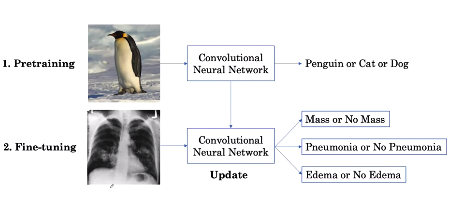

---
jupytext:
  text_representation:
    extension: .md
    format_name: myst
kernelspec:
  display_name: Python 3
  language: python
  name: python3
---
(ai_in_medicine)=

# AI for Medical Diagnosis #

## Week 1 - Medical Image Classification
### I. How to handle small and imbalance dataset

#### Resources
- Public Chest Xray 
    - dataset - https://nihcc.app.box.com/v/ChestXray-NIHCC
    - article - https://www.nih.gov/news-events/news-releases/nih-clinical-center-provides-one-largest-publicly-available-chest-x-ray-datasets-scientific-community
- Public CT Scans 
    - dataset - https://nihcc.app.box.com/v/DeepLesion
    - article - https://www.nih.gov/news-events/news-releases/nih-clinical-center-releases-dataset-32000-ct-images
- Image Preprocessor - https://keras.io/api/preprocessing/image/
- Journal Articles
    - Computer vision for Histopathology - https://www.ncbi.nlm.nih.gov/pmc/articles/PMC6257102/
    - Computer vision for Dermatology - https://www.nature.com/articles/nature21056
    - Computer vision for Endocrinology - https://www.nature.com/articles/s41433-018-0269-y

#### 3 Key Challenges for Medical Images

#### `1. Class Imbalance Challenge`
- `definition`: not equal number of positive (e.g. abnormal) and negative (e.g. normal) examples
- creates a problem for learning algorithm who see's many normal examples
- optimizing its updates to get normal examples to be right and not giving much relative weight not normal examples
    
#### Different types of Loss
1. Categorical Cross-Entropy Loss
1. Binary Cross-Entropy Loss
1. Cross-Entropy Loss
1. Softmax Loss
1. Logistic Loss

#### Problem: Binary Cross Entropy Loss
- `measures the performance of a classification model whose output is between 0 and 1`
- Regular Loss Function 

\begin{align}
    L(X,y) = \left\{ 
        \begin{matrix}
            -log P (Y=1|X) & if & y = 1 \\
            -log P (Y=0|X) & if & y = 0 \\
        \end{matrix} 
    \right\}
\end{align}

- `computational note` 
    - compute for probability equal to 1, given X: `P(Y=1|X)` 
        - formula
        \begin{align}
            L & = -logX 
        \end{align}
        - e.g. Malignant Sample (Y=1), Probability = 20% 
        \begin{align}
            L & = -log(0.20)  \\
            L & = 0.70 
        \end{align}

    - compute for probability equal to 0, given X: `P(Y=0|X)`
        - formula
        \begin{align}
            P(Y=0|X) & = 1 - P(Y=1|X) \\
            L & = -log(1 - X)  \\
        \end{align}
        - e.g. Benign Sample (Y=0), Probability = 70% 
        \begin{align}
            L & = -log(1 - 0.70)  \\
            L & = 0.52
        \end{align}
            
#### Solution 1: Weighted Loss 
- add weight relative to sample label or class
- Formula: Weighted Loss Function 
\begin{align}
    L(X,y) &= \left\{ 
        \begin{matrix}
            w_{p} &x& -log P (Y=1|X) & if & y = 1 \\
            w_{n} &x& -log P (Y=0|X) & if & y = 0 \\ \\
        \end{matrix} 
    \right\} 
\end{align}

\begin{align}
    L_{pos} &= w_{p} \times -log P (Y=1|X) \\ 
    L_{neg} &= w_{n} \times -log P (Y=0|X) \\ \\
    L^{(i)} &= loss_{pos}^{(i)} + los_{neg}^{(i)} \\
    L_{pos}^{(i)} &= -1 \times weight_{pos}^{(i)} \times y^{(i)} \times log(\hat{y}^{(i)}) \\
    L_{neg}^{(i)} &= -1 \times weight_{neg}^{(i)} \times (1- y^{(i)}) \times log(1 - \hat{y}^{(i)})
\end{align}

    where
\begin{align}
w_p = \frac{num ​​ negative}{num ​​ total}
\end{align}

\begin{align}
w_n = \frac{num ​​ positive}{num ​​ total}
\end{align}

#### Solution 2: Resampling
- to achieve equal number of normal and non-normal examples
- Formula: Regular Loss Function
\begin{align}
    L(X,y) = \left\{ 
        \begin{matrix}
             -log P (Y=1|X) & if & y = 1 \\
             -log P (Y=0|X) & if & y = 0 \\
        \end{matrix} 
    \right\}
\end{align}
    - `note`: no need to add weights but will yeild equal contribution 
- approaches
    - under sampling normal class 
    - over sampling non-normal class
        - replicating non-normal samples to reach quota

#### `2. Multi-Task Challenge`
- Binary Classification/Task
    - only 2 classes  in one model
        - e.g. benign vs malignant
- Multi-task
    - multiple classes in one model
        - e.g. mass or no mass, pneumonia or no pneumonia, edema or no edema
    
- Formula: Multi-Label/ Multi-Task Loss
\begin{align}
            L(X, y) & = L(X, y_{mass}) + L(X, y_{pneumonia}) + L(X, p=y_{edema})
\end{align}

- Sample Data

| Examples   (mass, pneumonia, edema) | Predicted Probabilities | Loss |
| --- | --- | --- |
| P1 0, 1, 0 | 0.3, 0.1, 0.8 | 0.52 + 1.00 + 0.70 |
| P2 0, 0, 1 | 0.1, 0.1, 0.8 | 0.05 + 0.05 + 0.10 |
| P3 0, 1, 1 | 0.2, 0.2, 0.7 | 0.10 + 0.70 + 0.15 |

- Formula: Binary Cross-Entropy Loss for Multi-Task Setting
\begin{align}
    L(X, y_{mass}) & = 
    \left\{ 
        \begin{matrix}
            w_{p, mass} &x& -log P (Y=1|X) & if & y = 1 \\
            w_{n, mass} &x& -log P (Y=0|X) & if & y = 0 \\
        \end{matrix} 
    \right\} \\
    L(X, y_{pneumonia}) & = 
    \left\{ 
        \begin{matrix}
            w_{p, pneumonia} &x& -log P (Y=1|X) & if & y = 1 \\
            w_{n, pneumonia} &x& -log P (Y=0|X) & if & y = 0 \\
        \end{matrix} 
    \right\} \\
    L(X, y_{edema}) & = 
    \left\{ 
        \begin{matrix}
            w_{p, edema} &x& -log P (Y=1|X) & if & y = 1 \\
            w_{n, edema} &x& -log P (Y=0|X) & if & y = 0 \\
        \end{matrix} 
    \right\} \\
    L(X, y) & = L(X, y_{mass}) + L(X, y_{pneumonia}) + L(X, p=y_{edema})
\end{align}

#### `3. Small Dataset Size Challenge`
- medical image datasets typically have `10 - 100 thousand` examples compared to millions on natural objects

- medical imaging challenges
    - model of choice is Convolutional Neural Networks
- Architectures of Convolutional Neural Networks
    1. Inception-v3
    1. ResNet-34
    1. DenseNet - https://arxiv.org/pdf/1608.06993.pdf
    1. ResNeXt 
    1. EfficientNet 
    
    
#### Solution 1: `Feature Learning` 
- Pretraining + Fine Tuning

 
 
- Steps
    1. Pretraining
        1. train the network to look at natural images and learn to identify natural objects to learn `general features` (e.g. edge detection feature) - using `Early Layers`
        1. copy and transfer learned features to next network layer
    1. Fine-Tuning
        1. further be trained to look at chest X-rays and identify the presence and absence of disease
        1. general features learned in pretraining can be then applied in the new task for `high-level features` - more specific to a task (e.g. Chest Xray) - using `Late Layers`
        1. only fine-tune Late Layers

- Solution:  `Feature Learning`

#### Solution 2: `Sample Generation` 
- Options
    1. Data Augmentation
        - Types of Transformation
            - Rotate + Flip
            - Rotate + Crop + Color Noise 
            - Reverse image orientation (Lateral inversion)
                - tricky in medicine due to medical conditions (e.g. dextrocardia)
            - Zooming in and out
            - Brightness and Contrast
            
            
### II. How well your model performs 
#### Model Testing
- Dataset Distribution
    - Training Set/Development Set
        - development and selection of models
        - use to learn a model
    - Validation Set/Tuning Set/Dev Set
        - use for hyperparameter tuning
        - estimate of model performance on test set
    - Test Set/Holdout Set
        - reporting of final results
 - `Cross Validation`: split between training and validation set
 
#### 3 Key Challenges in Building Sets

#### `1. Patient Overlap`
 - `Problem`: a single patient's multiple x-ray should only occur in 1 set (i.e. Training set)
     - the model may `memorize` a patient x-ray in training set and help get the right answer in test set (overly optimistic test performance)
 - `Solution`: a single patient with multiple x-ray should only have all x-ray data in 1 data set (e.g training set)
     
#### `2. Set Sampling`
##### Steps
1. Sample Test Sets 
    - sample first before validation and training
    - usually `10 %` of the whole dataset
    - test set needs to be annotated by human readers
        - bottleneck is the readers capacity to label
        - at least 100 of examples in medical AI studies
    - `Problem`:  might not be able to sample any patient with a particular disease that wasn't labeled, thus no way of testing the model for that particular disease
    - `Solution`: test set with at least `X%` of examples of minority class (i.e. positive class, malignant class)
        - if possible set to 50% (e.g. 50% with mass, 50% no mass) of total test sets
1. Sample Validation Set
    - use same sampling strategy and numbers of examples for Test Sets to reflect the Test set's distribution 
1. Sample Training Set
    - the remaining patients or datasets

#### `3. Ground Truth (Machine Learning)` or Reference Standard (Medicine)
- `Problem`: inter-observer disagreement
    - common in medicine
- `Solution 1`: consensus voting method
    - single decision or majority vote of group of human expert
    - e.g. Chest X-ray with radiologist experts
- `Solution 2`: definitive test 
    - confirmatory method relative to disease type
    - e.g. CT-Scan