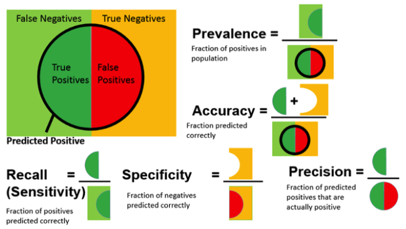

---
jupytext:
  text_representation:
    extension: .md
    format_name: myst
kernelspec:
  display_name: Python 3
  language: python
  name: python3
---
(ai_in_medicine)=

# AI for Medical Diagnosis #

## Week 2 - Key Evaluation Metrics 

#### Resources
- ROC visualizer 
    - link -  http://www.navan.name/roc/
    - paper - https://people.inf.elte.hu/kiss/13dwhdm/roc.pdf
    
### I. Accuracy, Sensitivity, Specificity

#### Accuracy and Probability
- proportion of the total examples that the model correctly classified
    
    \begin{align}
    Accuracy & = \frac{examples ​​ correctly ​​ classified}{total ​​ numbers ​​ of ​​ examples} \\
    & = P(correct) \\
    & = P(correct \cap disease) + P(correct \cap normal)
    \end{align}

- The `Law of Conditional Probability` expands the definition of Accuracy
    
    \begin{align}
    Using P(A \cap B) & = P(A|B)P(B)
    \end{align}
    
    `note`: the probability of A and B is equal to Probability of A given B times the probability of B
    
- adapted formula
    
    \begin{align}
   Accuracy & = P(correct|disease)P(disease) + P(correct|normal)P(normal) \\
   & = P(+|disease)P(disease) + P(-|normal)P(normal)
    \end{align}
    
#### Sensitivity or `True Positive Rate` or `Recall` 

- Formula
    \begin{align*}
    P(+|disease) & = \frac{ \# (+ ​​ and ​​ disease) }{\#(disease)} \\
    & = \frac{TP}{TP + FN}
    \end{align*}
    
    - `interpretation`: the probability of being `correct` given the patient has `disease` means 'positive'
    
#### Specificity or `True Negative Rate`  

- Formula
    \begin{align}
    P(-|normal) & = \frac{ \# (- ​​ and ​​ normal) }{\#(normal)} \\
    & = \frac{TN}{FP + TN}
    \end{align}
    
    - `interpretation`: the probability of being `correct` given the patient is `normal` means 'negative'

    
#### Prevalance 
- Prevelance
    - the number of disease or actual positive cases over total popluation
    
    \begin{align}
        Prevelance & = \frac{\#(disease)}{\#(total)} \\
        & = \frac{1}{N} \sum_i y_i \\
        & = np.mean(y)
    \end{align}
    
#### Accuracy in terms of Conditional Probability
- accuracy is the weighted average of sensitivity and specificity
    \begin{align}
       Accuracy & = P(+|disease)P(disease) + P(-|normal)P(normal) \\
       & = Sensitivity + Specificity \\
       & = Sensitivity \times P(disease) + Specificity \times P(normal) \\
       & = Sensitivity \times P(disease) + Specificity \times 1-P(disease) \\
       & = Sensitivity \times prevalence + Specificity \times 1-prevalence \\
    \end{align}
    
### II. Predictive Values
#### Positive Predictive Value (PPV) or `Precision`
- Sensitivty Notation 
    
    \begin{align*}
    P(+|disease) 
    \end{align*}
    
    `interpretation`: given we know that the patient has disease, what is the probability that the model predicts positive
    
- Positive Predictive Value 
    - Formula

    \begin{align*}
    P(disease|+)  & = \frac{\#(+​​ and ​​ disease)}{\#(+)} \\
    & = \frac{TP}{TP + FP}
    \end{align*}
    
    `interpretation`: given that the model predicts postive on a patient, what is the probability that the patient actually have the disease
    
#### *Positive Predictive Value in terms of Sensitivity, Specificity, and Prevalence 

- Rewriting `PPV`
    \begin{align*}
    PPV = P(pos|\hat{pos})
    \end{align*}
    - `pos` is the "actual positive"
    - `𝑝𝑜𝑠^` is the "predicted positive"
    
- by Bayes Rule,
    \begin{align*}
    PPV = \frac{P(pos|\hat{pos}) x P(pos)}{P(\hat{pos})}
    \end{align*}
    
##### For Numerator
- Formula
    \begin{align*}
        Sensitivity & = P(pos|\hat{pos}) \\
        Prevalence & = P(pos)
    \end{align*}

    - `sensitivity`: how well the model predicts actual positive cases as positive
    - `prevalence`: how many actual positives there are in the population
    
        
##### For Denominator 
- Formula
    \begin{align*}
        P(\hat{pos}) = TruePositive  + FalsePositive 
    \end{align*}
    - `predicted positives`: positive predictions are the sum of when it correctly predicts positive and incorrectly predicts positive.

    - `TruePositives` 
        - Formula
            \begin{align*}
            TruePositives & = P(\hat{pos}|pos) \times P(pos) \\
                          & = Sensitivity \times Prevalence 
            \end{align*}
    - `FalsePositives` 
        - Formula
            \begin{align*}
            FalsePostives & = P(\hat{pos}|neg) \times P(neg) \\
                          & = (1-Specificity) \times (1-Prevalence)
            \end{align*}

##### Final Derivation (PPV)

- Formula
    \begin{align*}
        PPV & = \frac{P(pos|\hat{pos}) x P(pos)}{P(\hat{pos})} \\
            & = \frac{Sensitivity \times Prevelance}{TruePositve + FalsePositive} \\
            & = \frac{Sensitivity \times Prevelance}{
            Sensitivity \times Prevalence 
            + 
            (1-Sensitivity) \times (1-Prevalence)
            } \\
    \end{align*}
    
#### Negative Predictive Value (NPV)
- Specificity  Notation
    
    \begin{align*}
    P(-|normal) 
    \end{align*}
    
    `interpretation`: given we know that the patient is normal, what is the probability that the model predicts negative 
    
- Negative Predictive Value 
    - Formula

    \begin{align*}
    P(normal|-) & = \frac{\#(- ​​ and ​​ normal)}{\#(-)} \\
    & = \frac{TP}{TP + FP}
    \end{align*}
    
    `interpretation`: given that the model predicts negative on a patient, what is the probability that the patient actually is normal 
    
    
#### F1 Score or `F-score` or `F-measure` 
- harmonic mean of precision and recall
    \begin{align*}
    F_1 score = 2 \times \frac{Precision \times Recall}{Precision + Recall}
    \end{align*}

#### Confusion Matrix
- use to look the performance of classifier in tabular presentation
    - can be used to compare the results of each classifier models
        - e.g. k-nearest vs logistic regression vs decision tree
- use to visualize the performane of binary classifier
    - but can be extended up to `3 classes` using `one vs all approach`
- tells what the machine learning algorithm did right and did wrong
- can be used to 3 or more classes

    - Ground Truth vs Model Output
    
    

    - Formula Summary 
    
    
    
    - Formula Transformation 
    
    
    
    - Visual Representation 
    
    
    

### III. ROC (Receiver Operator Characteristics) / AUC (Area Under the Curve)

- visual plot the sensitivty against the specificty at different decision thresholds 
- `threshold` or `operating point` or decision boundary
    - choosing the threshold is a business  or use case decision
- the choice of threshold affects the evaluation metrics being used
- is similiar to statistical boostraping, but instead of resampling to get the mean and draw a histogram out of the means, ROC is drawn out by adjusting the thresholds of the choosen algorithm (e.g. Logistic Regression). As thresholds are adjusted, corresponding confusion matrix also changes. When plotting all the confusion matrix in a X-axis (True Positive Rate) vs Y-axis (False Positive Rate), the final result will yeild a ROC graph

- `diagonal line` shows where the `True Positive Rate == False Positive Rate`
    - any point in the line means that the proportion of correclty (i.e. true positve) classified samples is the same as the proportion of the incorreclty (i.e. false positive) classified samples.
    - any point in the left part of the line means the porportion of correctly classified samples is greater than the incorreclty classified samples

#### `ROC Graph`
- summarizes all confusion matrices that each threshold produced

- ROC Sample
    
    
    
### IV. Confidence Interval 
- shows the variability of the estimates
- use to infer the sample size in comparison to population size
- `95% confidence`
    - `interpretation`: in repeated sampling, this model or method produces intervals (minimum and maximum interval) that include or will contain the population `accuracy` or `true` accuracy or `true` parameter/metric in about 95% of the samples
         - `accuracy` is arbitrary, any evaluation metrics may be used