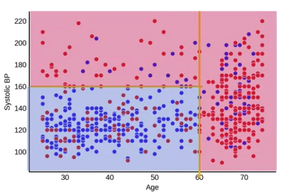
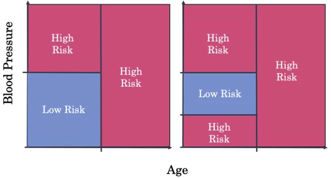

---
jupytext:
  text_representation:
    extension: .md
    format_name: myst
kernelspec:
  display_name: Python 3
  language: python
  name: python3
---
(ai_in_medicine)=

# AI for Medical Prognosis #

## Week 1 - Linear Prognostic Models

### Resources
- Chads-Vasc Risk Score
    - link - https://journal.chestnet.org/article/S0012-3692(10)60067-0/fulltext
- MELD's Score
    - link - https://aasldpubs.onlinelibrary.wiley.com/doi/full/10.1002/hep.21563
- ASCVD + 
    - link - https://www.ahajournals.org/doi/full/10.1161/01.cir.0000437738.63853.7a

### Prognosis Overview 
- Use Cases:
    1. predicting future events
        - heart attack
        - death
        - stroke
    1. informing patients
        - risk of illness
        - survival with illness
        - guiding treatment
        - 6-month mortality risk

### Prognosis in Medical Practice 

1. Atrial Fibriliation
    -  $ CHA_2DS_2-VASc $ ("`Chads Vasc`" Score)
        - for patients with Atrial Fibriliation and prognosis of `1-year risk of stroke`

    |     | Profile | Coefficient | Value | Coefficient   x Value |
    | --- | --- | --- | --- | --- |
    | C  | Congestive Heart Failure | 1 | 0 | 0 |  
    | H  | Hypertension             | 1 | 1 | 1 |  
    | A₂ | Age 75 years or older    | 2 | 0 | 0 |  
    | D  | Diabetes Mellitus        | 1 | 1 | 1 |  
    | S₂ | Stroke, TIA, or TE       | 2 | 0 | 0 |  
    | V  | Vascular disease.        | 1 | 0 | 1 |  
    | A  | Age 65 to 74 years.      | 1 | 1 | 1 |  
    | Sc | Sex category (female)    | 1 | 0 | 1 |  
    |    | Risk Score               |   |   | 3 |  

1. Liver Disease Mortality 
    - `MELD Score` ("Model for End-stage Liver Disease")
        - one factor that determines how quickly patient might get a liver transplant
        - provides estimate of 3-month mortality 
            - for patients for patients > 12 on liver transplant waiting lists
        
1. Risk of Heart Disease
    - `ASCVD Risk Estimator` ("Atherosclerotic Cardiovascular Disease")
    - 10-year risk of heart disease
        - for patients for patients > 20 who do not already have heart disease 

### Risk Equations
1. Interactions or Combined Features 
    - can include `interaction terms` (i.e. combining profiles or variables)
        - e.g.  $ age \times ln BP \times Coefficient_{Age,BP}  $
    - may not always be linear (i.e. natural log)
    
### Evaluation of Prognostic Model

#### 1. C-Index 
- Overview
    - measures how good the prognostic models
    - `does not` allow censored observation
    
- Formula
    \begin{align}
        C-index = \frac{\#(concordant\ pairs) + 0.5 \times \#(risk\ ties)}{\#(permissible\ pairs)} 
    \end{align}
    
- Constant 
    - +1.0 for a permissible pair that is concordant
    - +0.5 for a permissible pair for risk tie
    
- Properties
    - Random model score would score = 0.5
    - Perfect model score would score = 1.0
    
- Interpretation 

    \begin{align}
     P(score(A) > score(B) | Y_A > Y_B) 
    \end{align}
    
    `interpretation`: What is the probability that patient with worst outcome (i.e. Patient A) gets the higher risk score (i.e. score(A))

    
    
- Data Categories    

    1. Permissible Pair
        - a pair where outcomes are  different
    
    | | Patient A | Patient B |
    | --- | --- | --- |
    | Died within 10 Years | Yes  | No  |
    | Risk Score           | 0.7  | 0.8 |
    
    1. Concordant
        - patient with worst outcome with higher risk score

        | | Patient A | Patient B |
        | --- | --- | --- |
        | Died within 10 Years | Yes  | No   |
        | Risk Score           | 0.95 | 0.43 |

    1. Discordant
        - patient with worst outcome does not have high risk score

        | | Patient A | Patient B |
        | --- | --- | --- |
        | Died within 10 Years | No   | Yes  |
        | Risk Score           | 0.95 | 0.43 |

    1. Risk Ties

        | | Patient A | Patient B |
        | --- | --- | --- |
        | Died within 10 Years | Yes | No  |
        | Risk Score           | 0.7 | 0.7 |

    1. Ties in Outcome

        | | Patient A | Patient B |
        | --- | --- | --- |
        | Died within 10 Years | Yes  | Yes  |
        | Risk Score           | 0.94 | 0.65 |
    
    
- Example

    | Patient | Events | Risk |
    | --- | --- | --- |
    | A | Yes | 0.8  |
    | B | No  | 0.43 |
    | C | Yes | 0.62 |
    | D | Yes | 0.58 |
    | E | No  | 0.62 |
    
    - Permissible pairs
        - (A,B), (A,E), (B,C), (B,D), (C,E), (D,E)
        
    - Concordant pairs
        - (A,B), (A,E), (B,C), (B,D)
        
    - Risk Ties
        - (C,E)
        
    - Computation
        - $ C-index = \frac{4+0.5 \times 1}{6} $

## Week 2 - Prognosis with Tree-based Models

### Resources

- Dataset
    - reference - https://wwwn.cdc.gov/nchs/nhanes/nhefs/
    - link - https://wwwn.cdc.gov/nchs/nhanes/nhanes1/
- Shap Library
    - link - https://github.com/slundberg/shap
    - notebook - https://slundberg.github.io/shap/notebooks/NHANES%20I%20Survival%20Model.html

### Models
        
#### 1. Decision Trees
- Overview
    - can model non-linear relationships/association
    - incredibly useful mainly for the following reasons
        - can handle `continuous` and `categorical` data
        - interpretability
        - speed to train model
    
- Practical Application
    1.  `Short Term Mortality for Hospital Patients`
        - variables
            - 10 year mortality risk
            - using Age and Systolic Blood Pressure
        
- Decision boundary
    - dividing input spaces into regions using vertical and horizontal boundaries
        

        

    - a tree with `if-then` structure
        
            
- Building Decision Tree
    - High-Level Steps
        1. Pick a variable/value that partitions the data
            - determines how well the data are divided
        1. Continue the partition for vertical and horizontal
        1. For each partitions, estimate the risk
            - e.g fraction of patients that are dead
        1. Binarized the output
            - e.g High Risk/Low Risk 

    - Fixing Overfitting
        - Control or setting the `Max Depth`
            - stop growing the decision trees
            > Finding a model that minimizes and acceptably balances underfitting and overfitting (e.g. selecting the model with a `max_depth` of `2` over the other values) is a common problem in machine learning that is known as the _bias-variance tradeoff_
        - Build Random Forest
            - average the risk predictions of multiple decision tree
            - boost the performance of single decision tree

    - Random Forest Training
        - each tree is constructed using random samples 
            - same with `Bootstrapping` or sampling with replacement 
            - modifies the splitting procedures
                - each sampling may use only a `subset` of features (i.e. Age, BP, Sex) 

#### 2. Random Forests
- classifier algorithm
- compose of many decision trees
- has good predictive performance with low tuning
- also called `Ensembling learning method`
    - because it uses multiple decision trees to obtain better predicting performance
    - popular Ensemble Algorithm
        1. Gradient Boosting
        1. XGBoost
        1. LightGBM
        
### Key Challenges in Healthcare Data
1. Missing Data

#### Missing Data Methods
1. Missing Data Approaches 
    1. ****_`Exclusion Approach`_****
        - dropping of data for all dataset (i.e. test, train, validation)
        
        
            
        - can lead to bias models when applied to new test data
            - `problem`: distribution may be different due to dropping 
            - `solution`: plot difference in distribution
            
    1. ****_`Imputation Approach`_****
        - filling in of missing values with estimated value
        - different appraches
            1. **Mean Imputation**
                - `does not preserve` the relationship of variables
                - using mean in the `training` set and apply to missing values in `test` set
                    - because training set have larger samples, more representation of mean than test set
                    
            1. **Regression Imputation**
                - `preserves` the relationship of variables
                - example of linear function
                    \begin{align*} 
                    BP = coefficient_{age} \times age + offset
                    \end{align*} 
            
    
#### Missing Data Categories 
1. **_`Missing Completely At Random`_**
    - missingness is not dependent on anything
        - will not lead to bias
        - will have normal distribution 
    - notation
    
        \begin{align*} 
        p(missing) = constant 
        \end{align*} 

      where `constant` is 0.5 or coincidence rate
    - example
        - recording blood pressure reading based on `Coin Flip` approach

1. **_`Missing At Random`_**
    - missingness is dependent only on available information 
        - missingness is based on a certain criteria/condition
            - e.g. not taking blood pressure for young patients 
        - will lead to bias
        - will not have normal distribution 
    - notation
        \begin{align*} 
        p(missing) & \ne constant \\
        p(missing|age < 40) = 0.5 & \ne p(missing|age > 40) = 0
        \end{align*} 

      where `constant` is 0.5 or coincidence rate

    - example
        - recording blood pressure reading is based on `Coin Flip` approach if age < 40 years old

1. **_`Missing Not At Random`_**

    - missingness is dependent on unavailable information 
        - `unobservable` information
    - notation
        \begin{align*} 
        p(missing) & \ne constant \\
        p(missing|waiting) & = 0.5 \\
        p(missing|not \ waiting) & = 0
        \end{align*} 
    - example
        - recording blood pressure reading is based on `Coin Flip` approach if patient queueing is long, otherwise, if queue is short record all blood pressure reading

## Week 3 - Survival Models and Time

### Resources

- Survival Analysis Library (Lifeline)
    - link - https://lifelines.readthedocs.io/en/latest/
    - paper - http://www.medicine.mcgill.ca/epidemiology/hanley/c634/lifetables/abm_17.PDF
    

- Dataset 
    - link - https://www.statsdirect.com/help/content/survival_analysis/logrank.htm
    
### Survival and Hazard Models 
- known models
    1. Kaplan Meier
    1. Cox 
    1. Multiple Cox
    1. Nelson-Aelen estimator 

#### 1. Kaplan Meier Estimate  - Survival Estimator
- Overview
    - estimates from population
    - takes censored information into account
    - survival function is applied to patient in the population
        - not specific to particular patient profile
        - not individualize survival model

- Properties
    1. survival probability should never go up 
    1. survival probability starts as 1 and eventually gets to 0
    
- Notation
    \begin{align}
    S(t) & = \left\{ 
        \begin{matrix}
        1 \ if \ t & = 0 \\
        0 \ if \ t & = \infty 
        \end{matrix} 
    \right\}  \\ \\
    S(t) & = Pr(T > t)
    \end{align}

    \begin{align*}
    \end{align*}

    - The `Law of conditional probability` expands the Overview of Survivability

    \begin{align}
        P(A \cap B) & = P(A|B)P(B) \\
        P(A, B, C)  & = P(A|B,C)\ P(B|C)\ P(C) \\
    \end{align}

    - Chain rule of conditional probability applied to Survival Model

    \begin{align}
    S(25) & = Pr(T > 25) \\ 
          & = Pr(T \ge 26, T \ge 25, \ldots, T \ge 0 ) \\
          & = Pr(T \ge 26|T \ge 25) Pr(T \ge 25| T \ge 24) \ldots 
          P(T \ge 1| T \ge 0)P(T \ge 0)
    \end{align}

    since

    \begin{align}
    Pr(T \ge 26| T \ge 25) & = 1 - Pr(T=25|T \ge 25)  \\
    Pr(T \ge 25| T \ge 24) & = 1 - Pr(T=24|T \ge 24) \\ 
    \ldots \\
    Pr(T \ge 1| T \ge 0) & = 1 - Pr(T=0|T \ge 0) \\ 
    \end{align}

    therefore 
    \begin{align}
    S(25) = (1 - Pr(T=25|T \ge 25))\ (1 - PR(T=24|T \ge 24)) \ldots (1 - PR(T=0|T \ge 0))
    \end{align}

- Derived Formula
    \begin{align}
    S(t) & = \prod_{i=0}^t 1 - Pr(T=i|T \ge i) \\
    \end{align}
    
    simplified
    \begin{align}
          P(T = 25| T \ge 25) & = \frac{\#(died \ at \ 25)}{\#(known \ survived \ to \ 25)}
    \end{align}
    
    short hand notation
    \begin{align}
    S(t) & = \prod_{i=0}^t 1 - \frac{d_i}{n_i}
    \end{align}
    
    - Example
    
    | i | $ T_i $ |
    | --| -- |
    | 1 | 10 |
    | 2 | 8+ |
    | 3 | 60 |
    | 4 | 20 |
    | 5 | 12+|
    | 6 | 30 |
    | 7 | 15+|
       
    \begin{align}
        S(25) =& (1-Pr(T=25|T \ge 25))(1-Pr(T=24|T \ge 24)) \ldots (1-Pr(T=0|T \ge 0))
    \end{align}
    
    since the only T less than 25 are t=[10,20] (death that occured before T=25) and 10
    
    \begin{align}
        S(25) & = (1-Pr(T=20|T \ge 20))(1-Pr(T=10|T \ge 10)) 
    \end{align}
    
    derived
    
    \begin{align}
          P(T = 20| T \ge 20) & = \frac{\#(died \ at \ 20)}{\#(known \ survived \ to \ 20)} \\
          P(T = 10| T \ge 10) & = \frac{\#(died \ at \ 10)}{\#(known \ survived \ to \ 10)} \\
          S(25) & =  \left( \frac{\#(died \ at \ 20)}{\#(known \ survived \ to \ 20)} \right)
                     \left( \frac{\#(died \ at \ 10)}{\#(known \ survived \ to \ 10)} \right) \\
          S(25) & = \left( 1 - \frac{1}{3} \right) \left( 1 - \frac{1}{6} \right) \\
          S(25) & = 0.56
    \end{align}
    
    `note`: **censored data** or data with '+', do not equate to `death` 
     (i.e. **+20** $ \ne $ died at 20)
        
- Survival Data
    - types of data
        - actual events within timeframe
        - censored data
            - withdrawn/dropped out
            - study ends
    - key challenges and feature of survival analys
        - right censoring data
            - a type of missing data problem
            - right censored observations
                - time to event is only known to exceed a certain value
            - _`categories`_ of censoring
                1. **end-of-study** censoring
                1. **loss-to-follow-up** censoring
    - example
        - Treatment Given to Stroke Event
        
## Week 4 - Risk Models using Linear and Tree-based models

### Resources
- Dataset
    - link - https://biostat.app.vumc.org/wiki/Main/DataSets
- Cox Model
    - paper - https://www.jstor.org/stable/2985181?seq=1
- Random Survival Forest
    - paper - https://www.jstor.org/stable/2985181?seq=1 
- Harrel C-Index
    - paper - https://pubmed.ncbi.nlm.nih.gov/7069920/

### Hazard and Survival Functions

| | Survival Function | Hazard Function | Accumulated Hazard Function |
| --- | --- | --- | -- |
| Questions | What is the probabilty of survival past any time t? | What is a patient's `immediate risk of death` if they make it to time t? | What is the patients accumulated hazard upto time t? | 
| Formula | $ S(t) = Pr(T>t) $ | $ \lambda (t) = Pr(T = t| T \ge t) $ | $ \Lambda(t) = \sum_{i=0}^t \lambda(i) $ | 

#### 1. Generic Hazard Function 
- Overview 
    - can be use to create the survival function
- Properties
    - `bath tub curve`
        - e.g. risk increase immedately after surgery then decline then increases as time goes on
- Notation
    - Accumulative Hazard Formula to Survival Function Formula
        \begin{align}
        S(t)=exp(\int_0^t \lambda(u) du) 
        \end{align}

    - Survival to Hazard Formula
        \begin{align}
        \lambda(t) = - \frac{S^{'(t)}}{S(t)} 
        \end{align}

   `interpretation`: the hazard is rate of death if age t

#### 2. Nelson-Aalen Estimator - Accumulative Hazard Function 
- Notation
    - Formula
        \begin{align}
        H(t) & = \sum_{i=0}^t \frac{d_i}{n_i} \\
        \end{align}

        where 

        \begin{align}
          \frac{d_i}{n_i} & =  \frac{\#(num \ died \ at \ i)}{ \#(num \ survived \ at \ time \ i ) }
        \end{align}
    
    - Example

        | i | $ T_i $ |
        | --- | --- |
        | 1   | 35  |
        | 2   | 32  |
        | 3   | 27+ |
        | 4   | 30  |
        | 5   | 40  |
        | 6   | 5   |

        Exclude all event before 33
        
        \begin{align}    
        H(33) & = \sum_{i=0}^{33} \frac{d_i}{n_i} \\
              & = \frac{d_{32}}{n_{32}} + 
                  \frac{d_{30}}{n_{30}} + 
                  \frac{d_{5}}{n_{5}}  \\
              & = \frac{1}{3} \ \ \ + 
                  \frac{1}{4} \ \ \ + 
                  \frac{1}{6}  \\
              & = 0.75
        \end{align}    
        `note`: censored data are not included as event time (i.e. $ d_i $) but only as censoring time (i.e. $ n_i $)
        
#### Mortality Score 
- Overview
    - summation of accumulative hazards per region
        - use to compare risk of patients
        

#### 3. Cox Proportional Hazard
- Overview 
    - comparing the risk of different patients using own patient profile
        - specific to particular patient profile
        - individualize survival model
        
        
- Disadvantages
    - cannot model non-linear relations (e.g. age)
    - the hazard function for 2 patients is always proportional to each other
        - each patient can have different risk curves over time
            - e.g different intervention given (high dose vs low dose chemotherapy) 
                - high dose: high risk immediately, low risk over time (aggresive treatment)
                - low dose: low risk immediately, high risk over time (relapse)

- Notation
    - Formula 
        \begin{align}
        \lambda(t,x) = \lambda_0(t) \times exp(factor)
        \end{align}
        
        where $ \lambda_0 $ is baseline risk which is based on the hazard curve for the population and is always $ \ge 0 $
    
    - Derivation 
        \begin{align}
        \lambda(t,x) & = \lambda_0(t) \ exp(0.08 \times smoker + 0.01 \times age) \\
        & = \lambda_0(t) \ exp(\beta_1 \ \ \ \times X_1 \ \ \ \ \ \ \ + \beta_2 \ \ \ \times \  X_2 ) \\
        & = \lambda_0(t) \ exp(\beta_1X_1 + \beta_2 X_2 \ldots ) \\
        & = \lambda_0(t) \ exp(\sum_{i=0} \beta_i X_i ) \\
        \end{align}
        where `exp` is Euler number which is natural language of growth 
        
    - Vectorized Implementation 
    
        \begin{align}
        \lambda(t,x) & = \lambda_0(t) \ e^{(\theta^T X_i)} \\
        \lambda(t,x) & = \lambda_0(t) \ e^{(\theta X_i^T)}
        \end{align}
        
        where $ \theta^T or X^T $ is the tranpose row vector 
        
    - Numpy Convention
    
        \begin{align}
        lambdas = lambda_{0} * np.exp(np.dot(coef,X.T))
        \end{align}
        
        where $ \theta $ is the coefficient 
        
    - Example 
        
        Data
        
        |     | Age   $ X_1 $ | Cholesterol   $ X_2 $ |
        | --- | --- | --- |
        | 0  | 20   | 123 |
        | 1  | 21   | 100 |
        | 2  | 22   | 102 |
        | ... | ... | 90  |
        | 40 | 40   | 130 |
        
        | Variable   $ X_i $ | Weight   $ \beta $ | 
        | --- | --- |
        | Age | 0.01 |
        | Is_smoker| 0.10 |
       
        Given 
        
        \begin{align}
        \theta^T & = [ 0.01, 0.10 ]
        \\
        \\
        X_i = X_{1} X_2 & = \begin{bmatrix} 
         20 & 123 \\
         21 & 100 \\
         22 & 102 \\
         \ldots & \dots \\
         40 & 130 \\
        \end{bmatrix} 
        \end{align}
        
        Find
        \begin{align}
        \lambda(t,x) & = \lambda_0(t) \ e^{(\theta^T X_i)}
        \end{align}
    
    - Properties 
        
        | Variable   $ X_i $ | Weight   $ \beta $ | exp(Weight)   exp($ \beta $) |
        | --- | --- | --- |
        | Age | 0.01 | 1.01 |
        | HDL | -0.07 | 0.93 |
        
        1. if exponent of weights or exp($ B $) > 1 = `risk factor increasing`
            - if $ B $ is positive, `np.exp() of postive number is always > 1`
            - e.g. As age increase by 1 unit, the risk increases 
                
                \begin{align}
                \lambda(51,age) & = \lambda_0(t) \ exp(0.01 \times 50) \\
                \lambda(50,age) & = \lambda_0(t) \ exp(0.01 \times 51) \\ 
                \\
                \frac{ \lambda(51,age)} {\lambda(50,age)} & =
                \frac{  exp(0.01 \times 50)  }{ exp(0.01 \times 51)   } \\
                \\
                \lambda_1(t) & = 1.01
                \end{align}
                
                `interpretation`: for every 1 unit change of age, risk factor increases by 1.01
                
                \begin{align}
                \lambda_{age}(51)  = \lambda_{age}(50) \times 1.01
                \end{align}
                
        1. if exponent of weights or exp($ B $) < 1 = `risk factor decreasing` 
            - if $ B $ is negative, `np.exp() of negative number is always < 1`
            - e.g. As HDL increase by 1 unit, the risk decreases 
            
                \begin{align}
                \lambda_{HDL}(10)  = \lambda_{HDL}(9) \times 0.93
                \end{align}
        
#### 2. Survival Trees 
- Overview
    - can take patient variables into account to compare risk of different patients
    - are like binary decision trees
    - can model non-linear relationships
        - e.g. Pneumonia Hazard 
            - young age = high risk
            - middle age = low risk
            - old age = high risk
    
- Comparison
    | Decision Tree | Survival Tree |
    | --- | --- |
    | Binary Classifier | Time Event Classifier |
    | S(t) Survival Function per region | $ \Lambda(t) $ Accumulative Hazard Function per region |
    | Mortality | Hazard and Risk |
    |  |  | 
    |  |  | 
    
    
### Evaluation Survival Functions

#### 1. Harrel's C-index
- Overview
    - how good is the survival model
    - formula and constant same with prognostic model
    
- Formula
    \begin{align}
        C-index = \frac{\#(concordant\ pairs) + 0.5 \times \#(risk\ ties)}{\#(permissible\ pairs)} 
    \end{align}
    
- Constant 
    - +1.0 for a permissible pair that is concordant
    - +0.5 for a permissible pair for risk tie
    
- Comparison
    | | Prognostic Model | Survival Model |
    | --- | --- | --- | 
    | Ground Truth | Binary (Yes or No)  | Time to Event (30 months) |
    | censored observation | not allowed | allowed |
    
    
- Data Categories    
    1. Concordant
        - patient with worst outcome with higher risk score

        | | Patient A | Patient B   |
        | ---         | ---  | ---  |
        | T           | 20   | 40   |
        | Risk Score  | 0.95 | 0.43 |
        
        | | Patient A | Patient B   |
        | ---         | ---  | ---  |
        | T           | 20   | 20   |
        | Risk Score  | 0.60 | 0.60 |

    1. Discordant
        - patient with worst outcome does not have high risk score

        | | Patient A | Patient B   |
        | ---         | ---  | ---  |
        | T           | 20   | 40   |
        | Risk Score  | 0.40 | 0.65 |

    1. Risk Ties

        | | Patient A | Patient B   |
        | ---         | ---  | ---  |
        | T           | 20   | 40   |
        | Risk Score  | 0.65 | 0.65 |

        | | Patient A | Patient B   |
        | ---         | ---  | ---  |
        | T           | 40   | 40   |
        | Risk Score  | 0.40 | 0.65 |
    
    1. Permissible Pair 
        -  a pair where outcomes are different

        | | Patient A | Patient B   |
        | ---         | ---  | ---  |
        | T           | 20   | 40+  |
        | Risk Score  | 0.95 | 0.65 |
        
        | | Patient A | Patient B   |
        | ---         | ---  | ---  |
        | T           | 20   | 20+  |
        | Risk Score  | 0.95 | 0.65 |
        
    1. Non-Permissible Pair 
        - a pair that is incomparable due to censored time

        | | Patient A | Patient B   |
        | ---         | ---  | ---  |
        | T           | 20+  | 40   |
        | Risk Score  | 0.95 | 0.65 |
        
        | | Patient A | Patient B   |
        | ---         | ---  | ---  |
        | T           | 20+  | 40+  |
        | Risk Score  | 0.95 | 0.65 |
        
        | | Patient A | Patient B   |
        | ---         | ---  | ---  |
        | T           | 40+  | 40+  |
        | Risk Score  | 0.95 | 0.65 |
            
- Example

    | Patient | T | Risk |
    | --- | --- | --- |
    | A | 15+ | 0.65  |
    | B | 20  | 1.73 |
    | C | 5   | 0.70 |
    | D | 5+  | 0.54 |
    | E | 10. | 0.83 |
    
    `note`: Risk score may be computed from **Cox Proportional Hazard** or **Mortality Score**
    
    - Permissible pairs
        - (A,C), (A,E), (B,C), (B,E), (C,D), (C,E)
        
    - Concordant pairs
        - (A,C), (A,E), (C,D)
        
    - Risk Ties
        - None 
        
    - Computation
        \begin{align}
            C-index & = \frac{\#(concordant\ pairs) + 0.5 \times \#(risk\ ties)}{\#(permissible\ pairs)} \\
                    & = \frac{3 + 0.5 \times 0}{6} \\
                    & = 0.5
        \end{align}