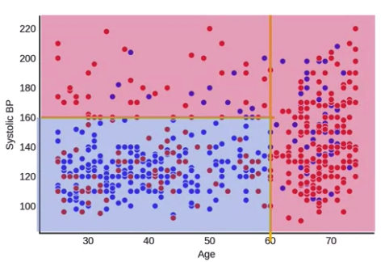
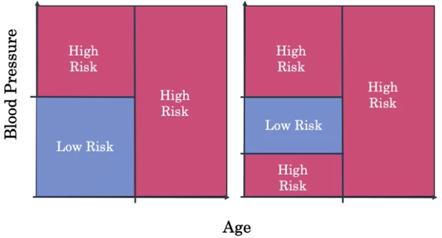
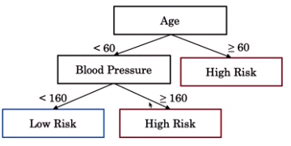
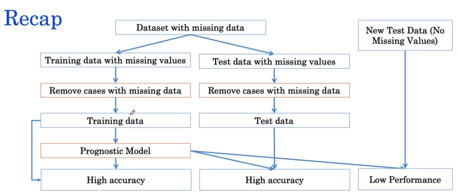

---
jupytext:
  text_representation:
    extension: .md
    format_name: myst
kernelspec:
  display_name: Python 3
  language: python
  name: python3
---
(ai_in_medicine)=

# AI for Medical Prognosis #

## Week 2 - Prognosis with Tree-based Models

### Resources

- Dataset
    - reference - https://wwwn.cdc.gov/nchs/nhanes/nhefs/
    - link - https://wwwn.cdc.gov/nchs/nhanes/nhanes1/
- Shap Library
    - link - https://github.com/slundberg/shap
    - notebook - https://slundberg.github.io/shap/notebooks/NHANES%20I%20Survival%20Model.html

### Models
        
#### 1. Decision Trees
- Overview
    - can model non-linear relationships/association
    - incredibly useful mainly for the following reasons
        - can handle `continuous` and `categorical` data
        - interpretability
        - speed to train model
    
- Practical Application
    1.  `Short Term Mortality for Hospital Patients`
        - variables
            - 10 year mortality risk
            - using Age and Systolic Blood Pressure
        
- Decision boundary
    - dividing input spaces into regions using vertical and horizontal boundaries
        

        

    - a tree with `if-then` structure
        
            
- Building Decision Tree
    - High-Level Steps
        1. Pick a variable/value that partitions the data
            - determines how well the data are divided
        1. Continue the partition for vertical and horizontal
        1. For each partitions, estimate the risk
            - e.g fraction of patients that are dead
        1. Binarized the output
            - e.g High Risk/Low Risk 

    - Fixing Overfitting
        - Control or setting the `Max Depth`
            - stop growing the decision trees
            > Finding a model that minimizes and acceptably balances underfitting and overfitting (e.g. selecting the model with a `max_depth` of `2` over the other values) is a common problem in machine learning that is known as the _bias-variance tradeoff_
        - Build Random Forest
            - average the risk predictions of multiple decision tree
            - boost the performance of single decision tree

    - Random Forest Training
        - each tree is constructed using random samples 
            - same with `Bootstrapping` or sampling with replacement 
            - modifies the splitting procedures
                - each sampling may use only a `subset` of features (i.e. Age, BP, Sex) 

#### 2. Random Forests
- classifier algorithm
- compose of many decision trees
- has good predictive performance with low tuning
- also called `Ensembling learning method`
    - because it uses multiple decision trees to obtain better predicting performance
    - popular Ensemble Algorithm
        1. Gradient Boosting
        1. XGBoost
        1. LightGBM
        
### Key Challenges in Healthcare Data
1. Missing Data

#### Missing Data Methods
1. Missing Data Approaches 
    1. ****_`Exclusion Approach`_****
        - dropping of data for all dataset (i.e. test, train, validation)
        
        
            
        - can lead to bias models when applied to new test data
            - `problem`: distribution may be different due to dropping 
            - `solution`: plot difference in distribution
            
    1. ****_`Imputation Approach`_****
        - filling in of missing values with estimated value
        - different appraches
            1. **Mean Imputation**
                - `does not preserve` the relationship of variables
                - using mean in the `training` set and apply to missing values in `test` set
                    - because training set have larger samples, more representation of mean than test set
                    
            1. **Regression Imputation**
                - `preserves` the relationship of variables
                - example of linear function
                    \begin{align*} 
                    BP = coefficient_{age} \times age + offset
                    \end{align*} 
            
    
#### Missing Data Categories 
1. **_`Missing Completely At Random`_**
    - missingness is not dependent on anything
        - will not lead to bias
        - will have normal distribution 
    - notation
    
        \begin{align*} 
        p(missing) = constant 
        \end{align*} 

      where `constant` is 0.5 or coincidence rate
    - example
        - recording blood pressure reading based on `Coin Flip` approach

1. **_`Missing At Random`_**
    - missingness is dependent only on available information 
        - missingness is based on a certain criteria/condition
            - e.g. not taking blood pressure for young patients 
        - will lead to bias
        - will not have normal distribution 
    - notation
        \begin{align*} 
        p(missing) & \ne constant \\
        p(missing|age < 40) = 0.5 & \ne p(missing|age > 40) = 0
        \end{align*} 

      where `constant` is 0.5 or coincidence rate

    - example
        - recording blood pressure reading is based on `Coin Flip` approach if age < 40 years old

1. **_`Missing Not At Random`_**

    - missingness is dependent on unavailable information 
        - `unobservable` information
    - notation
        \begin{align*} 
        p(missing) & \ne constant \\
        p(missing|waiting) & = 0.5 \\
        p(missing|not \ waiting) & = 0
        \end{align*} 
    - example
        - recording blood pressure reading is based on `Coin Flip` approach if patient queueing is long, otherwise, if queue is short record all blood pressure reading

