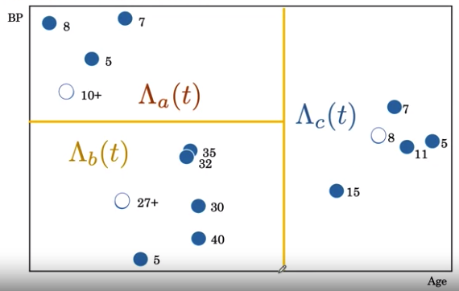
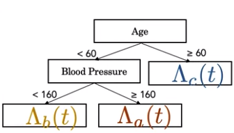

---
jupytext:
  text_representation:
    extension: .md
    format_name: myst
kernelspec:
  display_name: Python 3
  language: python
  name: python3
---
(ai_in_medicine)=

# AI for Medical Prognosis #

## Week 4 - Risk Models using Linear and Tree-based models

### Resources
- Dataset
    - link - https://biostat.app.vumc.org/wiki/Main/DataSets
- Cox Model
    - paper - https://www.jstor.org/stable/2985181?seq=1
- Random Survival Forest
    - paper - https://www.jstor.org/stable/2985181?seq=1 
- Harrel C-Index
    - paper - https://pubmed.ncbi.nlm.nih.gov/7069920/

### Hazard and Survival Functions

| | Survival Function | Hazard Function | Accumulated Hazard Function |
| --- | --- | --- | -- |
| Questions | What is the probabilty of survival past any time t? | What is a patient's `immediate risk of death` if they make it to time t? | What is the patients accumulated hazard upto time t? | 
| Formula | $ S(t) = Pr(T>t) $ | $ \lambda (t) = Pr(T = t| T \ge t) $ | $ \Lambda(t) = \sum_{i=0}^t \lambda(i) $ | 

#### 1. Generic Hazard Function 
- Overview 
    - can be use to create the survival function
- Properties
    - `bath tub curve`
        - e.g. risk increase immedately after surgery then decline then increases as time goes on
- Notation
    - Accumulative Hazard Formula to Survival Function Formula
        \begin{align}
        S(t)=exp(\int_0^t \lambda(u) du) 
        \end{align}

    - Survival to Hazard Formula
        \begin{align}
        \lambda(t) = - \frac{S^{'(t)}}{S(t)} 
        \end{align}

   `interpretation`: the hazard is rate of death if age t

#### 2. Nelson-Aalen Estimator - Accumulative Hazard Function 
- Notation
    - Formula
        \begin{align}
        H(t) & = \sum_{i=0}^t \frac{d_i}{n_i} \\
        \end{align}

        where 

        \begin{align}
          \frac{d_i}{n_i} & =  \frac{\#(num \ died \ at \ i)}{ \#(num \ survived \ at \ time \ i ) }
        \end{align}
    
    - Example

        | i | $ T_i $ |
        | --- | --- |
        | 1   | 35  |
        | 2   | 32  |
        | 3   | 27+ |
        | 4   | 30  |
        | 5   | 40  |
        | 6   | 5   |

        Exclude all event before 33
        
        \begin{align}    
        H(33) & = \sum_{i=0}^{33} \frac{d_i}{n_i} \\
              & = \frac{d_{32}}{n_{32}} + 
                  \frac{d_{30}}{n_{30}} + 
                  \frac{d_{5}}{n_{5}}  \\
              & = \frac{1}{3} \ \ \ + 
                  \frac{1}{4} \ \ \ + 
                  \frac{1}{6}  \\
              & = 0.75
        \end{align}    
        `note`: censored data are not included as event time (i.e. $ d_i $) but only as censoring time (i.e. $ n_i $)
        
#### Mortality Score 
- Overview
    - summation of accumulative hazards per region
        - use to compare risk of patients
        

#### 3. Cox Proportional Hazard
- Overview 
    - comparing the risk of different patients using own patient profile
        - specific to particular patient profile
        - individualize survival model
        
        
- Disadvantages
    - cannot model non-linear relations (e.g. age)
    - the hazard function for 2 patients is always proportional to each other
        - each patient can have different risk curves over time
            - e.g different intervention given (high dose vs low dose chemotherapy) 
                - high dose: high risk immediately, low risk over time (aggresive treatment)
                - low dose: low risk immediately, high risk over time (relapse)

- Notation
    - Formula 
        \begin{align}
        \lambda(t,x) = \lambda_0(t) \times exp(factor)
        \end{align}
        
        where $ \lambda_0 $ is baseline risk which is based on the hazard curve for the population and is always $ \ge 0 $
    
    - Derivation 
        \begin{align}
        \lambda(t,x) & = \lambda_0(t) \ exp(0.08 \times smoker + 0.01 \times age) \\
        & = \lambda_0(t) \ exp(\beta_1 \ \ \ \times X_1 \ \ \ \ \ \ \ + \beta_2 \ \ \ \times \  X_2 ) \\
        & = \lambda_0(t) \ exp(\beta_1X_1 + \beta_2 X_2 \ldots ) \\
        & = \lambda_0(t) \ exp(\sum_{i=0} \beta_i X_i ) \\
        \end{align}
        where `exp` is Euler number which is natural language of growth 
        
    - Vectorized Implementation 
    
        \begin{align}
        \lambda(t,x) & = \lambda_0(t) \ e^{(\theta^T X_i)} \\
        \lambda(t,x) & = \lambda_0(t) \ e^{(\theta X_i^T)}
        \end{align}
        
        where $ \theta^T or X^T $ is the tranpose row vector 
        
    - Numpy Convention
    
        \begin{align}
        lambdas = lambda_{0} * np.exp(np.dot(coef,X.T))
        \end{align}
        
        where $ \theta $ is the coefficient 
        
    - Example 
        
        Data
        
        |     | Age   $ X_1 $ | Cholesterol   $ X_2 $ |
        | --- | --- | --- |
        | 0  | 20   | 123 |
        | 1  | 21   | 100 |
        | 2  | 22   | 102 |
        | ... | ... | 90  |
        | 40 | 40   | 130 |
        
        | Variable   $ X_i $ | Weight   $ \beta $ | 
        | --- | --- |
        | Age | 0.01 |
        | Is_smoker| 0.10 |
       
        Given 
        
        \begin{align}
        \theta^T & = [ 0.01, 0.10 ]
        \\
        \\
        X_i = X_{1} X_2 & = \begin{bmatrix} 
         20 & 123 \\
         21 & 100 \\
         22 & 102 \\
         \ldots & \dots \\
         40 & 130 \\
        \end{bmatrix} 
        \end{align}
        
        Find
        \begin{align}
        \lambda(t,x) & = \lambda_0(t) \ e^{(\theta^T X_i)}
        \end{align}
    
    - Properties 
        
        | Variable   $ X_i $ | Weight   $ \beta $ | exp(Weight)   exp($ \beta $) |
        | --- | --- | --- |
        | Age | 0.01 | 1.01 |
        | HDL | -0.07 | 0.93 |
        
        1. if exponent of weights or exp($ B $) > 1 = `risk factor increasing`
            - if $ B $ is positive, `np.exp() of postive number is always > 1`
            - e.g. As age increase by 1 unit, the risk increases 
                
                \begin{align}
                \lambda(51,age) & = \lambda_0(t) \ exp(0.01 \times 50) \\
                \lambda(50,age) & = \lambda_0(t) \ exp(0.01 \times 51) \\ 
                \\
                \frac{ \lambda(51,age)} {\lambda(50,age)} & =
                \frac{  exp(0.01 \times 50)  }{ exp(0.01 \times 51)   } \\
                \\
                \lambda_1(t) & = 1.01
                \end{align}
                
                `interpretation`: for every 1 unit change of age, risk factor increases by 1.01
                
                \begin{align}
                \lambda_{age}(51)  = \lambda_{age}(50) \times 1.01
                \end{align}
                
        1. if exponent of weights or exp($ B $) < 1 = `risk factor decreasing` 
            - if $ B $ is negative, `np.exp() of negative number is always < 1`
            - e.g. As HDL increase by 1 unit, the risk decreases 
            
                \begin{align}
                \lambda_{HDL}(10)  = \lambda_{HDL}(9) \times 0.93
                \end{align}
        
#### 2. Survival Trees 
- Overview
    - can take patient variables into account to compare risk of different patients
    - are like binary decision trees
    - can model non-linear relationships
        - e.g. Pneumonia Hazard 
            - young age = high risk
            - middle age = low risk
            - old age = high risk
    
- Comparison
    | Decision Tree | Survival Tree |
    | --- | --- |
    | Binary Classifier | Time Event Classifier |
    | S(t) Survival Function per region | $ \Lambda(t) $ Accumulative Hazard Function per region |
    | Mortality | Hazard and Risk |
    |  |  | 
    |  |  | 
    
    
### Evaluation Survival Functions

#### 1. Harrel's C-index
- Overview
    - how good is the survival model
    - formula and constant same with prognostic model
    
- Formula
    \begin{align}
        C-index = \frac{\#(concordant\ pairs) + 0.5 \times \#(risk\ ties)}{\#(permissible\ pairs)} 
    \end{align}
    
- Constant 
    - +1.0 for a permissible pair that is concordant
    - +0.5 for a permissible pair for risk tie
    
- Comparison
    | | Prognostic Model | Survival Model |
    | --- | --- | --- | 
    | Ground Truth | Binary (Yes or No)  | Time to Event (30 months) |
    | censored observation | not allowed | allowed |
    
    
- Data Categories    
    1. Concordant
        - patient with worst outcome with higher risk score

        | | Patient A | Patient B   |
        | ---         | ---  | ---  |
        | T           | 20   | 40   |
        | Risk Score  | 0.95 | 0.43 |
        
        | | Patient A | Patient B   |
        | ---         | ---  | ---  |
        | T           | 20   | 20   |
        | Risk Score  | 0.60 | 0.60 |

    1. Discordant
        - patient with worst outcome does not have high risk score

        | | Patient A | Patient B   |
        | ---         | ---  | ---  |
        | T           | 20   | 40   |
        | Risk Score  | 0.40 | 0.65 |

    1. Risk Ties

        | | Patient A | Patient B   |
        | ---         | ---  | ---  |
        | T           | 20   | 40   |
        | Risk Score  | 0.65 | 0.65 |

        | | Patient A | Patient B   |
        | ---         | ---  | ---  |
        | T           | 40   | 40   |
        | Risk Score  | 0.40 | 0.65 |
    
    1. Permissible Pair 
        -  a pair where outcomes are different

        | | Patient A | Patient B   |
        | ---         | ---  | ---  |
        | T           | 20   | 40+  |
        | Risk Score  | 0.95 | 0.65 |
        
        | | Patient A | Patient B   |
        | ---         | ---  | ---  |
        | T           | 20   | 20+  |
        | Risk Score  | 0.95 | 0.65 |
        
    1. Non-Permissible Pair 
        - a pair that is incomparable due to censored time

        | | Patient A | Patient B   |
        | ---         | ---  | ---  |
        | T           | 20+  | 40   |
        | Risk Score  | 0.95 | 0.65 |
        
        | | Patient A | Patient B   |
        | ---         | ---  | ---  |
        | T           | 20+  | 40+  |
        | Risk Score  | 0.95 | 0.65 |
        
        | | Patient A | Patient B   |
        | ---         | ---  | ---  |
        | T           | 40+  | 40+  |
        | Risk Score  | 0.95 | 0.65 |
            
- Example

    | Patient | T | Risk |
    | --- | --- | --- |
    | A | 15+ | 0.65  |
    | B | 20  | 1.73 |
    | C | 5   | 0.70 |
    | D | 5+  | 0.54 |
    | E | 10. | 0.83 |
    
    `note`: Risk score may be computed from **Cox Proportional Hazard** or **Mortality Score**
    
    - Permissible pairs
        - (A,C), (A,E), (B,C), (B,E), (C,D), (C,E)
        
    - Concordant pairs
        - (A,C), (A,E), (C,D)
        
    - Risk Ties
        - None 
        
    - Computation
        \begin{align}
            C-index & = \frac{\#(concordant\ pairs) + 0.5 \times \#(risk\ ties)}{\#(permissible\ pairs)} \\
                    & = \frac{3 + 0.5 \times 0}{6} \\
                    & = 0.5
        \end{align}