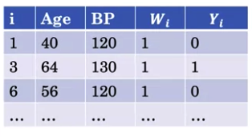
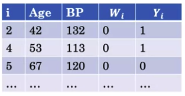
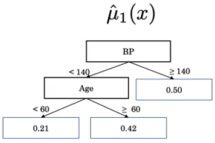
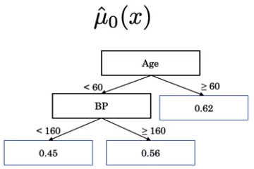
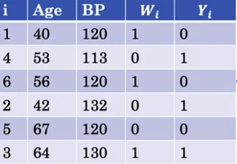
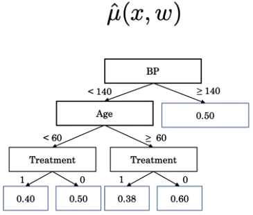

---
jupytext:
  text_representation:
    extension: .md
    format_name: myst
kernelspec:
  display_name: Python 3
  language: python
  name: python3
---
(ai_in_medicine)=

# AI for Medical Treatment #

## Week 1 - Treatment Effect Estimation 

### Resources

- Levamisole and fluororacil background
    - link - https://www.nejm.org/doi/full/10.1056/NEJM199002083220602
- Dataset
    - link - https://www.rdocumentation.org/packages/survival/versions/3.1-8/topics/colon
    
- C-statistics for benefit
    - paper - https://www.ncbi.nlm.nih.gov/pubmed/29132832
    
- T-learner method
    - paper - https://arxiv.org/pdf/1706.03461.pdf

    

### Randomized Control Trials
- Treatment Effect
    - measured as 
        1. `Absolute Risk (AR)`
            - `Absolute Risk Reduction (ARR)`
                - difference of AR between treatment group and control/placebo group
        1. `Number Need to Treat (NNT)`
            - the reciprocal of ARR
                - $ 1/AR $
                
- Randomized Controlled Trial (RCT)
    - random sampling
    
### Treatment Effect Estimator 

#### 1. Neyman-Rubin Causal Model - Causal Inference

- Causal Inference
    - types of group
        1. With Treatment
            - Unobserved/Counter factual
        1. Without Treatment
            - Observed/Factual
    - Fundamental problem of Causal Inference
        - outcome don't get to observed (i.e. `unobserved outcome`) what would have happen to the patient under placebo/controlled/without treatment group if treatment would have been given 
    - `Average Treatment Effect (ATE)` 
        - is the `expection` of the difference in potential outcomes
        - is the negative or ARR
    - `Conditional Average Treatment Effect (CATE)` 
        - is the individualized estimate of the benefit based on given factors
        - `conditioning`d a estimation based on a variable

- **Neyman-Rubin Causal Model tabular representation** 

    | i | $Y_i$(1)   outcome with treatment | $Yi$(0)   outcome without treatment | $Y_i$(1)-$Y_i$(0)   unit level treatment effect |
    | --- | --- | --- | ---  |
    | 1   | no heart attack   | has heart attack  | benefit   |
    | 2   | has heart attack  | has heart attack  | no effect |
    | 3   | no heart attack   | no heart attack   | no effect |
    | 4   | has heart attack  | no heart attack   | harm      |

- Average Treatment Effect Table treatment in Theory
    
    | i | $Y_i$(1) | $Yi$(0) | $Y_i$(1)-$Y_i$(0) |
    | --- | --- | --- | ---  |
    | 1   | 0   | 1   | -1   |
    | 2   | 1   | 1   |  0   |
    | 3   | 1   | 0   |  1   |
    | 4   | 0   | 0   |  0   |
    | 5   | 0   | 1   | -1   |
    | Mean| 0.4 | 0.6 | -0.2 |
    
    where  1 is benefit, -1 is harm, 0 is no effect 
    
    - `Average Treatment Effect ATE`: -0.2 
    - `interpretation`: 0.2 is average decrease in risk with treatment 
    

- Average Treatment Effect Table treatment in Practice in `Non-Randomized Controlled Trails`
    - fails to depict Neyman-Rubin Causal Model
    
    | i | $W_i$   treatment | $Y_i$(1)   outcome with treatment | $Yi$(0)   outcome without treatment | $Y_i$(1)-$Y_i$(0)   Effect |
    | --- | --- | --- | --- | ---  |
    | 1   | 1   | 0   |  ?   | ?   |
    | 2   | 0   | ?   |  1   | ?   |
    | 3   | 1   | 1   |  ?   | ?   |
    | 4   | 1   | 0   |  ?   | ?   |
    | 5   | 0   | ?   |  1   | ?   |
    
    where `?` is the unobserved outcome

- Average Treatment Effect Table treatment in Practice in `Randomized Controlled Trails`
    - each group is treated separately
    
    - Notation
        \begin{align}
        \mathbb{E}[Y_I(1) - Y_i(0)] = \mathbb{E}[Y_i|W=1] - \mathbb{E}[Y_i|W=0]
        \end{align}
        
    - Example
    | i | $W_i$   treatment | $Y_i$   outcome | 
    | --- | --- | --- |
    | 1 | 1 | 0 |
    | 3 | 1 | 1 |
    | 4 | 1 | 0 |
    | ... | ... | ... |
    | Mean | | 0.32 |

    | i | $W_i$   treatment | $Y_i$   outcome | 
    | --- | --- | --- |
    | 2 | 0 | 1 |
    | 5 | 0 | 1 |
    | 6 | 0 | 0 |
    | ... | ... | ... |
    | Mean | | 0.51 |
    
- Conditional Average Treatment Effect Table in `Randomized Controleld Trial` 
    - Notation
        \begin{align}
        \mathbb{E}[Y_I(1) - Y_i(0)|X = x]
        \end{align}
        
    - Example
    | i | age | $W_i$   treatment | $Y_i$   outcome | 
    | --- | --- | --- | --- |
    | 14 | 56 | 1 | 0 |
    | ... | ... | ... | ... |
    | 18 | 56 | 1 | 1 |
    | Mean | | | 0.50 |

    | i | age | $W_i$   treatment | $Y_i$   outcome | 
    | --- | --- | --- | --- |
    | 23 | 56 | 0 | 0 |
    | Mean | | | 0 |
    
    \begin{align}
    \mathbb{E}[Y_I(1) - Y_i(0)|Age = 56]  & =
    \mathbb{E}[Y_I|W = 1, Age = 56 ]  -  
    \mathbb{E}[Y_I|W = 0, Age = 56 ] \\   
    & = 0.50 - 0 \\
    & = 0.50 
    \end{align}
    `problem`: very few examples to directly estimate from data, thus not a precise estimate 
    
    `solution`: learn relationship between variables (e.g. Age, BP) and Y (i.e. outcome) to get estimates
        - can be learned by **Base Learners Models** types
            - Decision Tree Model
            - Linear Model
        - example notation
            \begin{align}
            \mathbb{E}[Y_I(1) - Y_i(0)|Age = 56, BP = 120] 
            \end{align}
            
### Individual Treatment Effect Estimator 
    
#### 1. Two-Tree (T-Learner) Method 

- Overview
    - Randomized controlled trial data of both in treatment and control group are trained separately 
    - CATE can be extracted by subtracting $\mu_1$ and $\mu_0$
    
- Consideration
    - `problem`: since 2 models are using each half of the data, there are fewwer samles available to learn the relationships between features
    - `solution`: need to have enough data available
    
- Notation
    \begin{align}
        \mathbb{E}[Y_I(1) - Y_i(0)|X = x]  \\
    \end{align}
    
    \begin{align}
        \mathbb{E}[W=1|X = x] & -  \mathbb{E}[W=0|X = x] 
    \end{align}
    
    | treatment response function | control response function |
    | --- | --- |
    | $\mathbb{E}[W=1|X = x]$ |  $\mathbb{E}[W=0|X = x] $ |
    | $\hat{\mu_1}(x)$        |  $\hat{\mu_0}(x)$ |
    | prognostic model for risk of adverse event when with treatment | prognostic model for risk of adverse event when without treatment |
    
    
- Example

    | | |
    | --- | --- |
    | | |
    | | |
    
- Solution
    \begin{align}
    \hat{\mu_1} & = \mathbb{E}[Y_i|W=1, Age=56, BP=130] = 0.21 \\
    \hat{\mu_0} & = \mathbb{E}[Y_i|W=0, Age=56, BP=130] = 0.45 \\
    \end{align}
    
    \begin{align}
    \mathbb{E}[Y_I(1) - Y_i(0)|X = x] & =  \hat{\mu_1} - \hat{\mu_0} \\  
        & = 0.21 - 0.45 \\
        & = -0.24
    \end{align}
    `interpretation`: 0.24 is average decrease in risk when patient is in treatment
    
    
    
#### 2. Single-Tree (S-Learner) Method 
- Overview
    - Randomized controlled trial data of both in treatment and control group are trained together
    
- Consideration
    - `problems`
        - model might leave treatment feature out
        - model might produce a treatment effect estimate of 0 for everyone
            - model could be good at estimating the risk with and without treatment, predicting the same risk for both, therefore the difference in these 2 expected outcomes would be 0

- Notation
    \begin{align}
        \mathbb{E}[Y_I(1) - Y_i(0)|X = x]  \\
    \end{align}
    
    \begin{align}
        \mathbb{E}[W=1|X = x] & -  \mathbb{E}[W=0|X = x] 
    \end{align}
    
    | treatment response function | control response function |
    | --- | --- |
    | $\mathbb{E}[W=1|X = x]$ |  $\mathbb{E}[W=0|X = x] $ |
    | $\hat{\mu}(x,1)$ | $\hat{\mu}(x,0)$ |
    
- Example

    | | 
    | -- |
    | |
    | |

- Solution
    \begin{align}
    \hat{\mu}(x,1) & = \mathbb{E}[Y_i|W=1, Age=56, BP=130] = 0.40 \\
    \hat{\mu}(x,0) & = \mathbb{E}[Y_i|W=0, Age=56, BP=130] = 0.50 \\
    \end{align}
    
    \begin{align}
    \mathbb{E}[Y_I(1) - Y_i(0)|X = x] & =  \hat{\mu}(x,1) - \hat{\mu}(x,0) \\  
        & = 0.40 - 0.50 \\
        & = -0.1
    \end{align}
    `interpretation`: 0.1 is average decrease in risk when patient is in treatment
    
### Evaluation of Treatment Effect Estimator 

- Overview
    - `problem`: To know the real effect of treatment, we must know know the counterfactual
        - What is the effect if treatment was not given
        - How to evaluate ITE of unobservable data or the unknown Y(0)  (i.e. the supposed outcome of patient who did not receive treatment if they had been givne treatment)
    - `solutions`: find data in controlled group or Y(0)
        1. with similar feature (i.e. Age, BP)
        1. with similar ITE estimate
 
- Steps
    1. Get pair or match for patient for Y(1) in Y(0) 
    1. Get the Average ITE to get the `predicted` TE
    1. Subtract the Factual Outcome (i.e. Y(1) - Y(0)) to get the Outcome
    
- Example

    - Pair 1(Patient1, Patient2) 
    
    | | Patient 1 | Patient 2 |
    | --- | --- | --- |
    | group | treatment | controlled |
    | age   | 56  | 53  |
    | BP    | 130 | 136 |
    | ITE   | -0.33 | -0.35 |
    | treatment | W = 1  | W = 0 |
    |factual outcome| Y(1) = 0  | Y(0) = 1 |
    
    - Compute Individualized Treatment Effect (ITE)
        \begin{align}
        prediction & = \frac{ITE_{patient1} + ITE_{patient2}}{\#(ITE)} \\
        \\
        & = \frac{-0.33 + -0.35}{2}  \\
        \\
        Outcome & = Y(1) - Y(0) \\
        & = 0 - 1 \\
        & = - 1 
        \end{align}
        
        \begin{align}
        \end{align}
        
        `note`: **Y(0)** means patient in controlled group (e.g. without treatment) exhibited an event (e.g. Heart attack) while **Y(1)** means patient in treatment group that did not exhibit an event. Thus, it can be infered that the treatment is the only factor for the causality for the non existence of the event for patient with treatment against those without treatment, with the assumption that patient have very similar features (i.e. age, BP, etc.)  
        
    - Grouping for Predicted Outcome 
        |  Y(1) - Y(0) | label |
        | --- | ---              |
        | -1  | Observed Benefit |
        | 0   | No Effect        |
        | +1  | Observed Harm    |
    

#### 1. C-for-benefit
- Overview
    - similar to C-index
        - but deal with 3 possible `predicted outcomes`
                
- Pair (controlled and treatment patient) Categories    
    - `note`: negative estimate means reduce risk when patient in treatment and negative outcome means Observed Benefit
    
    1. Permissble Pairs
        - pair with different outcomes
        
        |          | Pair A | Pair B |
        | ---      | ---   | ---     |
        | estimate | 0.20 | 0.10     |
        | Outcome  | 1    | 0        |
    
    1. Concordant
        - pair with higher effect estimate has better outcome 

        |          | Pair A | Pair B |
        | ---      | ---   | ---     |
        | estimate | 0.20 | -0.34    |
        | Outcome  | 1    | -1       |
        
    1. Not Concordant
        - pair with higher effect estimate have lower outcome 
        
        |          | Pair A | Pair B |
        | ---      | ---   | ---     |
        | estimate | 0.20 | 0.23     |
        | Outcome  | 1    | -1       |
        
    1. Risk Tie 
        - pair with same effect estimate but different outcome
        
        |          | Pair A | Pair B |
        | ---      | ---   | ---     |
        | estimate | 0.20 | 0.20     |
        | Outcome  | 1    | -1       |
        
    1. Tie  in Outcome
        - pair with different effect estimate but same outcome
        
        |          | Pair A | Pair B |
        | ---      | ---   | ---     |
        | estimate | 0.20 | 0.10     |
        | Outcome  | 1    | 1        |
        
        
- Formula
    - Computation
        \begin{align}
            C-index & = \frac{\#(concordant\ pairs) + 0.5 \times \#(risk\ ties)}{\#(permissible\ pairs)} 
        \end{align}
        
- Example - **Manual**

    |          | Pair A | Pair B | Pair C | Pair D |
    | ---      | ---    | ---    | ---    | ---    |
    | estimate | 0.20   | -0.34  | 0.02   | 0.22   |
    | Outcome  | 1      | -1     | 0      | 0      |
        
    - Permissible pairs
        - (A,B), (A,C), (A,D), (B,C), (B,D)
        
    - Concordant pairs
        - (A,B), (A,C), (B,C), (B,D)
        
    - Risk Ties
        - None 
           
    - Computation 
        \begin{align}
            C-index & = \frac{\#(concordant\ pairs) + 0.5 \times \#(risk\ ties)}{\#(permissible\ pairs)} \\
                    & = \frac{4 + 0.5 \times 0}{5} \\
                    & = 0.8 
        \end{align}
        
        
- Example - **Actual**

    - Step 1: Separate control and treatment group
    
    | i   | $X_i$  | $W_i$  | $Y_i$  | ITE    | -- | i     | $X_i$  | $W_i$  | $Y_i$  | ITE    |
    | --- | ---    | ---    | ---    | ---    | -- | ---   | ---    | ---    | ---    | ---    |
    | 0.  | ...    | 1      | 0      |  -0.23 | -- | 1.    | ...    | 0      | 0      |  -0.01 |  
    | 2.  | ...    | 1      | 1      |  +0.01 | -- | 3.    | ...    | 0      | 1      |  -0.33 |  
    | ... | ...    | ...    | ...    |   ...  | -- | ...   | ...    | ...    | ...    |   ...  |  
    | 4.  | ...    | 1      | 0      |  -0.02 | -- | 6.    | ...    | 0      | 1      |  +0.02 |  
    
    - Step 2: Sort and Match patient with similiar or ITE 
    
    | i   | $X_i$  | $W_i$  | $Y_i$  | ITE    | -- | i     | $X_i$  | $W_i$  | $Y_i$  | ITE    |
    | --- | ---    | ---    | ---    | ---    | -- | ---   | ---    | ---    | ---    | ---    |
    | 34. | ...    | 1      | 0      |  -0.34 |<-->| 3.    | ...    | 0      | 0      |  -0.33 |  
    | 25. | ...    | 1      | 1      |  -0.32 |<-->| 54.   | ...    | 0      | 1      |  -0.33 |  
    | ... | ...    | ...    | ...    |   ...  | -- | ...   | ...    | ...    | ...    |   ...  |  
    | 63. | ...    | 1      | 0      |  -0.29 |<-->| 62.   | ...    | 0      | 1      |  -0.26 |  
    
    `note`: **ITE can be computed either using S-Learner or T-Learner Methods**
    
    - Step 3: Compute the difference of Y (i.e. YD) and average of ITE (i.e. TE) 
    
    | Pair   | YD  | TE     |
    | ---    | --- | ---    |
    | (34,3) | -1  | -0.335 |
    | (25,54)|  0  | -0.325 |
    | ...    | ... | ...    |
    | (63,62)| -1  | -0.275 |
    
    - Step 4: Compute the C-for-Benefit
    
        **C-For-Benefit**: S-Learner 0.60, T-Learner 0.56
        
        `interpretation`:  Given 2 randomly chosen Pairs (i.e. A and B), the probability that the model correctly identifies the patient pair with the greater treatment benefit is 60 percent.