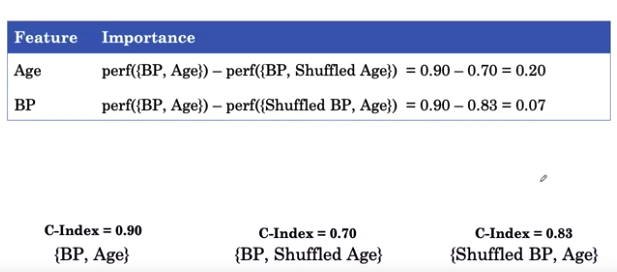
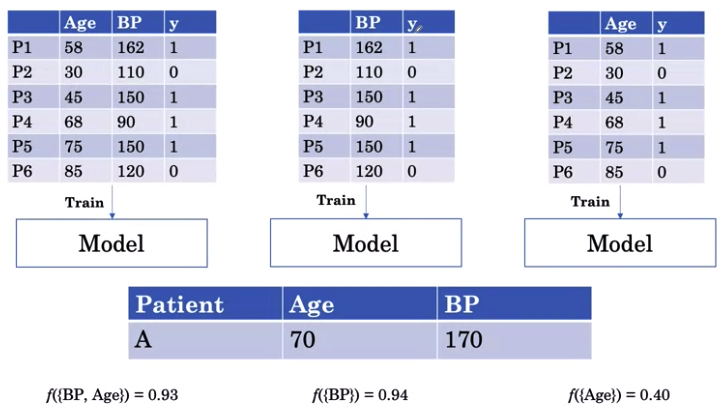

---
jupytext:
  text_representation:
    extension: .md
    format_name: myst
kernelspec:
  display_name: Python 3
  language: python
  name: python3
---
(ai_in_medicine)=

# AI for Medical Treatment #

## Week 3 - Machine Learning Interpretation 

### Resources

- Labeling Methods
    - paper - https://arxiv.org/abs/1905.04610
    - dataset - https://stanfordmlgroup.github.io/competitions/chexpert/
    - additional dataset - https://arxiv.org/abs/1901.07042
    - labeller - https://github.com/stanfordmlgroup/chexpert-labeler
    
- Huggingface transformer 
    - library - https://github.com/huggingface/transformers

- BERT 
    - paper - https://arxiv.org/abs/1810.04805

- Questions Answering 
    - dataset -  https://rajpurkar.github.io/SQuAD-explorer/

- Clinical Notes for Question
    - link - https://www.coursera.org/learn/ai-for-medical-treatment/supplement/EoLL0/citations
    

### Global Feature Importance

- use to determine and find the importance of each feature to a model overall

#### 1. Drop-Column Method
        
- Steps
    1. drop each feature sets (i.e. separate individually)

     
    
    1. train each sets

     

    1. computing the test performance (i.e. prognostic models using metrics such as c-index)

     

    1. compute the difference

    | Model Features | Importance Value |
    | --- | --- |
    | {Age} | perf({BP,Age}) - perf({BP}) = 0.90 - 0.82 = 0.08 |
    | {BP}  | perf({BP,Age}) - perf({Age}) = 0.90 - 0.85 = 0.05 |
       
    - `problem`: computationally expensive as it requires permutation for each features
    
    - `solution`: **Permutation Method**
        - can be used without need for retraining a model
        - works with any model that data is structured in tables 
        
        - Steps
            1. shuffle each feature instead of dropping, then train the model
            
             
            
            1. computing the difference
            
             
            
### Individual Feature Importance

- use to determine and find the importance of each feature to a model for a single patient

- Steps
    1. Train a model to predict the outcome `y` using blood pressure and age 
    
     
    
    1. get single patient data to examine 
    
     
    
    1. produce the output of the model `f({BP,Age})` (i.e. `f({70,170})`) and the **not the perforamnce** of the model (i.e. `c-index`)
    
     
    
    1. repeat steps 1 to 3 for all features
    
     
    
    1. compute the difference of the specific function
    
     
    
    - `problem`: fails to recognized correlated features (e.g. break down BP into systolic `sBP` and diastolic `dBP`)
    
         
        
        - the difference in systolic `sBP` and diastolic `dBP` have very low feature importance difference even though the feature BP played a big role in the risk (i.e. function f of `0.55`)
    
    - `solution`: **Shapley Values**
    
#### 1. Shapley Values Method
- can assign values of feature importance correclty even with correlated features

- tells how how much each feature contributes to the additional risk on-top and over the baseline risk (i.e. prevalence) of the population

##### Shapley Values Method for Individual Patient
- Steps
    1. Consider all feature sets (e.g. Age, dBP, sBP) that contains the feature (e.g sBP) to be isolated/evaluated for importance and compare it to the feature sets with its own absence
    
     
    
    `note`: empty set `{}` is the prevalence of the disese
    
    1. Train the 8 models (4 contain sBP, and 4 contain no sBP) and compute the function 
    
     
    
    `note`: empty set `{}` of 0.10 means 10% of the population have the event 
    
    1. Find different permutation of the feature sets vs feature set without the sBP feature 
    
     
    
    1. Compute the difference and average the importance in the models to get the Shapley Value 
    
     
    
    1. Repeat Step 1 to 4 to get Shapley Values for other features (e.g. Age, dBP) sets
    
     
    
    1. Shapley Value tells how how much each feature contributes to the additional risk on-top and over the baseline risk (i.e. prevalence) of the population
    
     
    
    1. Visualize the each feature importance or Shapley value with respect to all feature sets in a `force plot`
    
     
    
##### Shapley Values Method for all Dataset 

- Steps
    1. Compute the Shapley values for all patients
    
     
    
    1. Use `summary plot` to visualize the distribution of the values for each of the features
    
     
    
    1. Average the Shapley value for each featgure and use `bar summary plot` to visualize the global or overall feature importance 
    
     
    
### Convolutional Neural Network Interpretation 

#### 1. Heatmap
- Spatial Maps
    - usulaly the last layer of convolutional layer
        - typically 10 x 10x k (i.e Spatial Maps)
- Grad-CAM Method